# Assignments List

|Section|Lessons|Assignments|
|---|---|---|
|[Elements And Naming](https://elzero.org/css-assignments-lesson-from-1-to-4/)|1 → 4|6|
|[Background, Margin, Padding](https://elzero.org/css-assignments-lesson-from-5-to-8/)|5 → 8|4|
|[Border, Outline, Display](https://elzero.org/css-assignments-lesson-from-9-to-12/)|9 → 12|2|
|[Nesting, Dimensions, Overflow](https://elzero.org/css-assignments-lesson-from-13-to-16/)|13 → 16|2|
|[Text Formatting](https://elzero.org/css-assignments-lesson-from-17-to-21/)|17 → 21|4|
|[Inheritance, Typography](https://elzero.org/css-assignments-lesson-from-22-to-26/)|22 → 26|3|
|[Float, Opacity](https://elzero.org/css-assignments-lesson-from-27-to-29/)|27 → 29|2|
|[Position, List, Table](https://elzero.org/css-assignments-lesson-from-30-to-33/)|30 → 33|4|
|[Pseudo Classes, Pseudo Elements](https://elzero.org/css-assignments-lesson-from-34-to-37/)|34 → 37|4|
|[Border Radius, Box Shadow](https://elzero.org/css-assignments-lesson-from-38-to-41/)|38 → 41|3|
|[Transitions, Variables](https://elzero.org/css-assignments-lesson-from-42-to-45/)|42 → 45|3|
|[Flex Box](https://elzero.org/css-assignments-lesson-from-46-to-53/)|46 → 53|6|
|[Filters, Gradient](https://elzero.org/css-assignments-lesson-from-54-to-56/)|54 → 56|2|
|[Grid](https://elzero.org/css-assignments-lesson-from-57-to-64/)|57 → 64|6|
|[Scale, Rotate, Translate](https://elzero.org/css-assignments-lesson-from-65-to-67/)|65 → 67|3|
|[Skew, Matrix, 3D Transform](https://elzero.org/css-assignments-lesson-from-68-to-73/)|68 → 73|5|
|[Animation](https://elzero.org/css-assignments-lesson-from-74-to-77/)|74 → 77|4|
|[Selectors](https://elzero.org/css-assignments-lesson-from-78-to-82/)|78 → 82|8|
|[Media Queries](https://elzero.org/css-assignments-lesson-from-83-to-85/)|83 → 85|3|
|[Global Values](https://elzero.org/css-assignments-lesson-from-86-to-88/)|86 → 88|2|
|[All Course](https://elzero.org/css-assignments-lesson-from-1-to-88/)|1 → 88|25|

---

# Assignments Solutions

## Elements And Naming

### Assignment 1

```css
/* Any Element With Class Title */
.title {}

/* Any Element With ID Nav */
#nav {}

/* Any div Element */
div {}

/* Any h2 Element */
h2 {}
```

---

### Assignment 2

```html
<!-- External -->
<link rel="stylesheet" href="css/file.css" />

<!-- Internal -->
<style>
p {
  color: red;
}
</style>

<!-- Inline -->
<p style="color: blue;">This Is Our Paragraph</p>
```

---

### Assignment 3

```html
<link rel="stylesheet" href="assets/css/master.css" />
```

---

### Assignment 4

```html
<link rel="stylesheet" href="../source/css/main.css" />
```

---

### Assignment 5

```html
<!-- كنسل -->
```

---

### Assignment 6

```html
<!-- كنسل -->
```

---

## Background, Margin, Padding

### Assignment 1

```css
.assign-1-shape-1,
.assign-1-shape-2,
.assign-1-shape-3 {
  width: 500px;
  margin: 20px auto;
  padding: 20px;
  color: white;
}

.assign-1-shape-1 {
  background-color: #8a2be2;
  background-color: rgb(138, 43, 226);
  background-color: hsl(271, 76%, 53%);
}

.assign-1-shape-2 {
  background-color: rgba(138, 43, 226, 0.5);
}

.assign-1-shape-3 {
  background-color: rgba(138, 43, 226, 0.1);
}
```

<div style="display:flex; justify-content:center; align-items:center; gap:16px; flex-wrap:wrap;"> 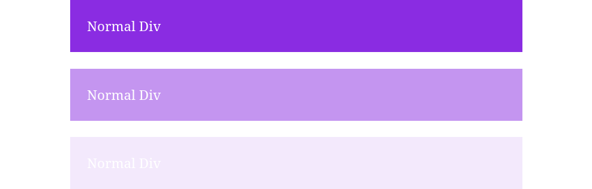 </div>

---

### Assignment 2

```css
.assign-2-shape-1,
.assign-2-shape-2,
.assign-2-shape-3,
.assign-2-shape-4 {
  width: 400px;
  height: 400px;
  background-image: url(images/css-assignment-5-8.png);
}

.assign-2-shape-1 {
  background-repeat: no-repeat;
}

.assign-2-shape-2 {
  background-repeat: repeat-y;
}

.assign-2-shape-3 {
  background-repeat: repeat-x;
}
```

<div style="display:flex; justify-content:center; align-items:center; gap:16px; flex-wrap:wrap;"> 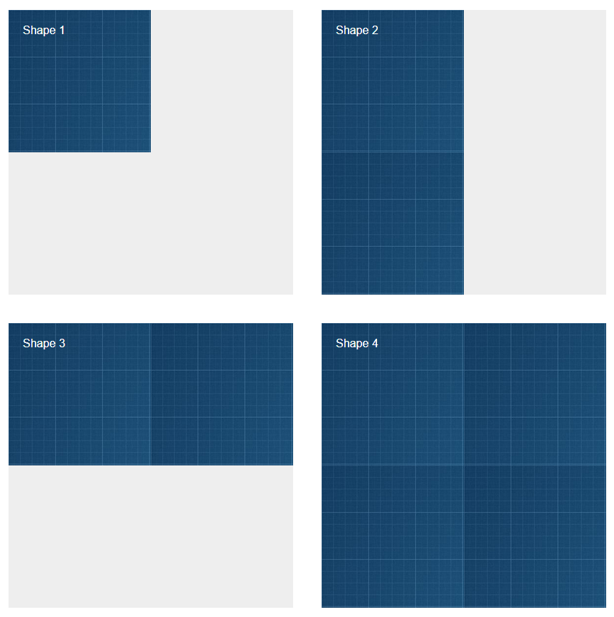 </div>

---

### Assignment 3

```css
.assign-3-shape-1 {
  background-repeat: no-repeat;
}

.assign-3-shape-2 {
  background-repeat: repeat-y;
  background-position: 100%;
}

.assign-3-shape-3 {
  background-repeat: repeat-x;
  background-position: 0% 100%;
}
```

<div style="display:flex; justify-content:center; align-items:center; gap:16px; flex-wrap:wrap;"> 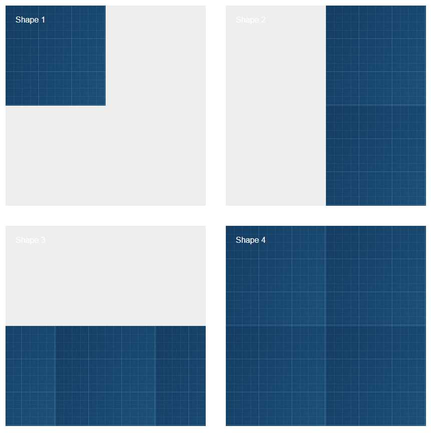 </div>

---

### Assignment 4

```css
.assign-4-shape-1 {
  background-size: 80% 80%;
  background-repeat: no-repeat;
}

.assign-4-shape-2 {
  background-size: 80% 80%;
  background-repeat: repeat-y;
  background-position: 100%;
}

.assign-4-shape-3 {
  background-size: 80% 80%;
  background-repeat: repeat-x;
  background-position: 0% 100%;
}

.assign-4-shape-4 {
  background-repeat: no-repeat;
  background-size: 50% 50%;
  background-position: bottom right;
}
```

<div style="display:flex; justify-content:center; align-items:center; gap:16px; flex-wrap:wrap;"> 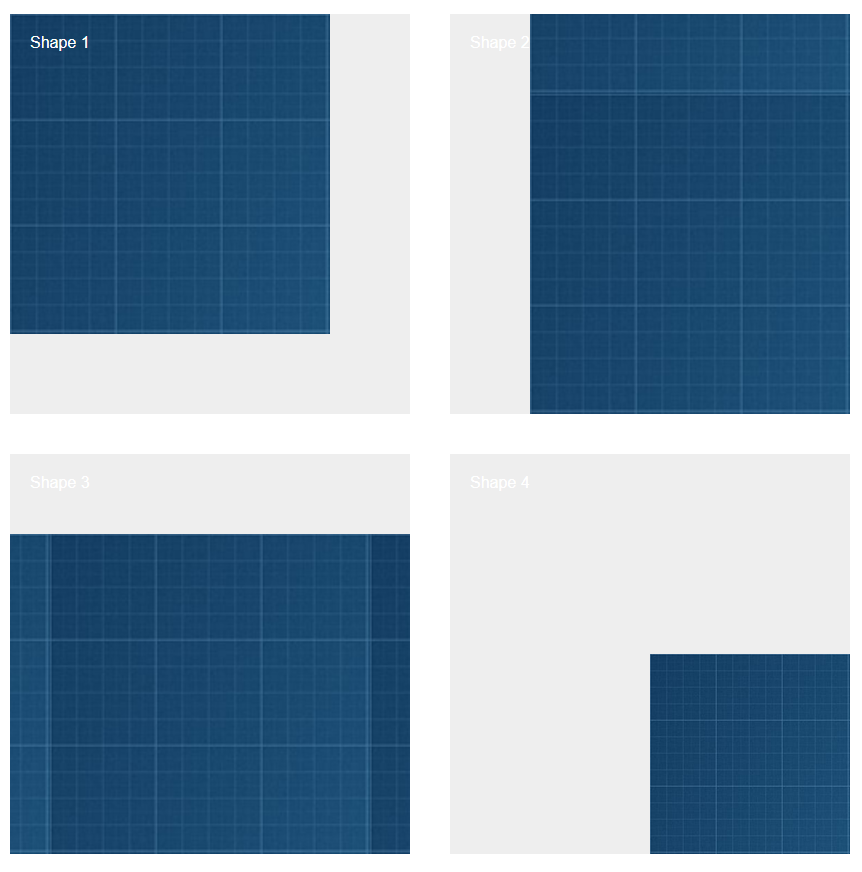 </div>

---

## Border, Outline, Display

### Assignment 1

```css
.element {
  background-color: #ddd;
  display: inline-block;
  border: 5px solid;
  outline: 5px solid black;
  margin: 25px;
  padding: 25px;
}

.element-1 {
  border-color: red;
}

.element-2 {
  border-color: blue green;
}

.element-3 {
  border-color: red green blue yellow;
  border-style: dashed;
}
```

<div style="display:flex; justify-content:center; align-items:center; gap:16px; flex-wrap:wrap;"> 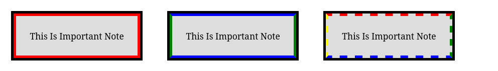 </div>

---

### Assignment 2

```css
/* كنسل */
```

---

## Nesting, Dimensions, Overflow

### Assignment 1

```css
.parent .child .title {
  color: red;
}

.parent .title {
  color: blue;
}

.parent p,
.title {
  color: green;
}
```

<div style="display:flex; justify-content:center; align-items:center; gap:16px; flex-wrap:wrap;"> 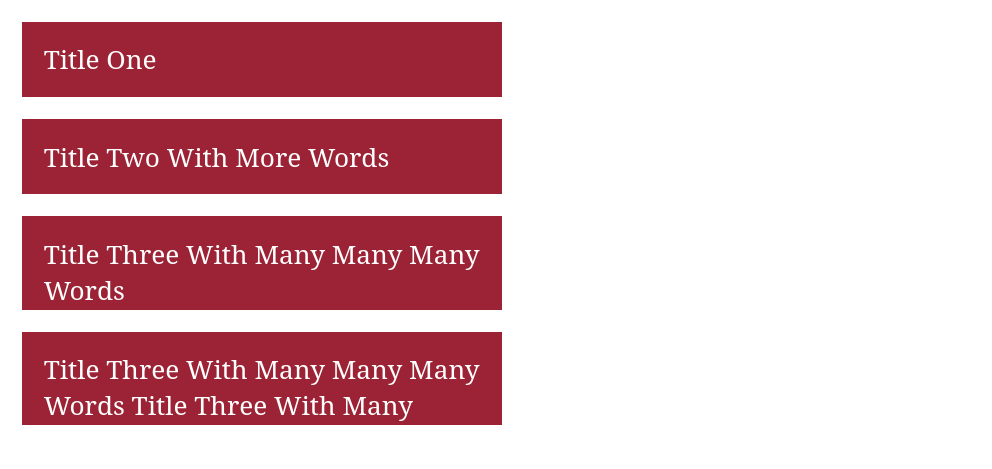 </div>

---

### Assignment 2

```html
<div class="box">Title One</div>
<div class="box">Title Two With More Words</div>
<div class="box">Title Three With Many Many Many Words</div>

<div class="box box-overflow">
Title Three With Many Many Many Words Title Three With Many Many Many Words
Title Three With Many Many Many Words Title Three With Many Many Many Words
</div>
```

```css
body {
  background-color: #fff;
  font-family: Georgia, serif;
  padding: 20px;
}

.box {
  background-color: #9b2335;
  color: #fff;
  font-size: 1.5rem;
  padding: 18px 20px;
  margin-bottom: 20px;
  max-width: 400px;
  max-height: 50px;
}

.box-overflow {
  overflow: hidden;
}
```

<div style="display:flex; justify-content:center; align-items:center; gap:16px; flex-wrap:wrap;">  </div>

---

## Text Formatting

### Assignment 1

```css
p {
  text-transform: capitalize;
  font-size: 4rem;
  font-family: Arial, Helvetica, sans-serif;

  text-shadow:
    2px 2px 0 #ff3b3b,
    3px 3px 0 #3b6aff,
    4px 4px 0 #7c3bff;
}
```

<div style="display:flex; justify-content:center; align-items:center; gap:16px; flex-wrap:wrap;"> 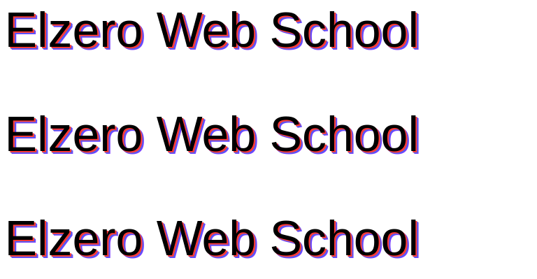 </div>

---

### Assignment 2

```css
.one {
  text-transform: uppercase;
}

.two {
  text-transform: uppercase;
}

.three {
  text-transform: lowercase;
}
```

<div style="display:flex; justify-content:center; align-items:center; gap:16px; flex-wrap:wrap;"> 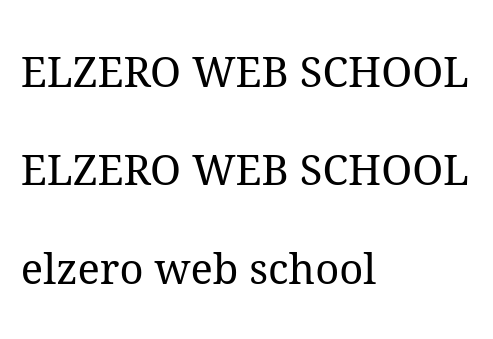 </div>

---

### Assignment 3

```css
div {
  background: #f0f0f0;
  padding: 20px;
  margin: 20px auto;
  width: 500px;
}

.single {
  white-space: nowrap;
  overflow: hidden;
}

.ellipsis {
  white-space: nowrap;
  overflow: hidden;
  text-overflow: ellipsis;
}
```

<div style="display:flex; justify-content:center; align-items:center; gap:16px; flex-wrap:wrap;"> 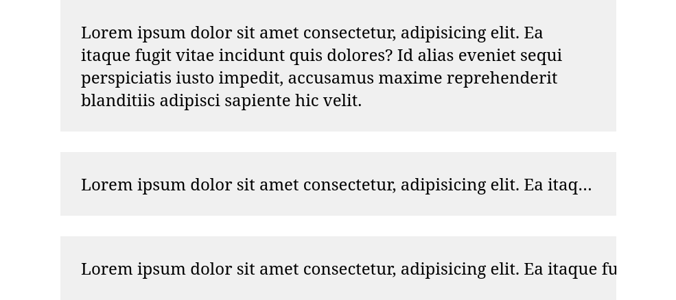 </div>

---

### Assignment 4

```css
a {
	width: fit-content;
	display: block;
	background-color: #009688;
	text-transform: capitalize;
	font-family: Arial, Helvetica, sans-serif;
	color: #fff;
	text-decoration: none;
	font-size: 2.5rem;
	font-weight: bold;
	padding: 60px 120px;
	border-bottom: #013933 solid 20px;
}
```

<div style="display:flex; justify-content:center; align-items:center; gap:16px; flex-wrap:wrap;">  </div>

---

## Inheritance, Typography

### Assignment 1

```css
div {
  background-color: #fff;
  padding: 20px;
  margin: 20px auto;
  width: 500px;
  border: 2px red solid;
  text-align: center;
}

div p {
  background: #f0f0f0;
  border: inherit;
  padding: inherit;
}
```

<div style="display:flex; justify-content:center; align-items:center; gap:16px; flex-wrap:wrap;"> 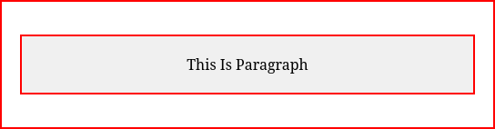 <span></span> 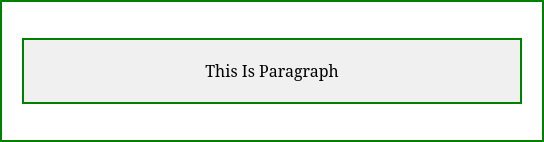 </div>

---

### Assignment 2

```css
.p1 {
  font-family: "Open Sans";
  font-weight: 300;
  font-style: italic;
  font-size: 50px;
}

.p2 {
  font-family: "Cairo";
  font-weight: 700;
  font-style: italic;
  font-size: 50px;
}

.p3 {
  font-family: Georgia, "Times New Roman", Times, serif;
  font-weight: 400;
  font-style: italic;
  font-size: 50px;
}
```

<div style="display:flex; justify-content:center; align-items:center; gap:16px; flex-wrap:wrap;">  </div>

---

### Assignment 3

```css
html {
  font-size: 20px;
}

.p1 {
  font-size: 2.5rem;
}

.p2 {
  font-size: 2rem;
}

.p3 {
  font-size: 1.5rem;
}
```

<div style="display:flex; justify-content:center; align-items:center; gap:16px; flex-wrap:wrap;"> 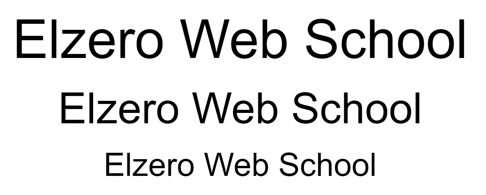 </div>

---

## Float, Opacity

### Assignment 1

```html
<div class="parent">
  <div class="son son1">Full Width</div>

  <div class="son son2">1/3</div>
  <div class="son son3">1/3</div>
  <div class="son son4">1/3</div>

  <div class="son son5">1/2</div>
  <div class="son son6">1/2</div>

  <div class="son son7">1/4</div>
  <div class="son son8">1/4</div>
  <div class="son son9">1/4</div>
  <div class="son son10">1/4</div>
</div>
```

```css
body {
  min-height: 100vh;
  margin: 0;
  background: #fff;
}

.parent {
  width: 1000px;
  padding: 0;
  background-color: #eee;
  overflow: hidden;
}

.son {
  margin-left: 15px;
  margin-bottom: 15px;
  background-color: rgb(216, 216, 216);
  text-align: center;
  height: calc((100% - 75px) / 4);
  float: left;
}

.son1 {
  margin-top: 15px;
  float: none;
}

.son2,
.son3,
.son4 {
  width: calc((100% - 60px) / 3);
}

.son5,
.son6 {
  width: calc((100% - 45px) / 2);
}

.son7,
.son8,
.son9,
.son10 {
  width: calc((100% - 75px) / 4);
}

.son1,
.son4,
.son6,
.son10 {
  margin-right: 15px;
}
```

<div style="display:flex; justify-content:center; align-items:center; gap:16px; flex-wrap:wrap;"> 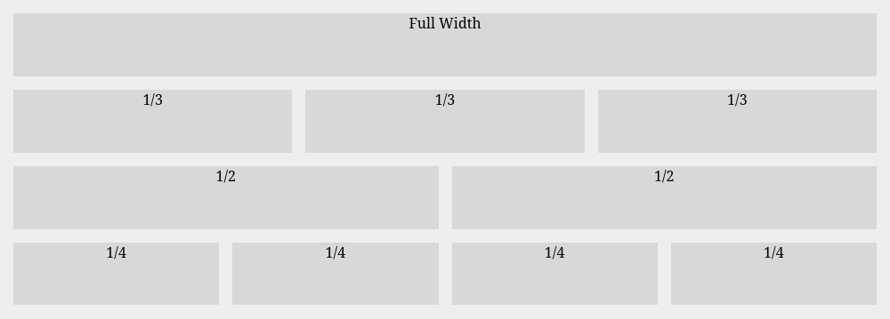 </div>

---

### Assignment 2

```css
.one {
  background-color: rgb(128, 128, 128, 0.1);
}

.two {
  opacity: 0.1;
}
```

<div style="display:flex; justify-content:center; align-items:center; gap:16px; flex-wrap:wrap;"> 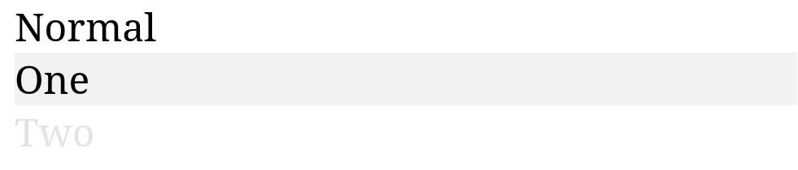 </div>

---

## Position, List, Table

### Assignment 1

```css
.green,
.blue,
.red,
.black {
  position: absolute;
  width: 100px;
  height: 100px;
}

.green {
  background-color: #009688;
  z-index: 3;
  top: 30px;
  left: 30px;
}

.blue {
  background-color: #03a9f4;
  top: 20px;
  left: 20px;
  z-index: 1;
}

.black {
  background-color: black;
  height: 10px;
  width: 10px;
  top: 120px;
  left: 20px;
  z-index: 2;
}

.red {
  background-color: #f44336;
  z-index: 4;
  top: 40px;
  left: 40px;
}
```

<div style="display:flex; justify-content:center; align-items:center; gap:16px; flex-wrap:wrap;">  </div>

---

### Assignment 2

```css
div {
  background-color: aliceblue;
  width: 400px;
  margin: 20px auto;
  border: 1px solid;
  border-color: blueviolet blue;
  position: relative;
  padding: 10px;
}

.top-left,
.bottom-left,
.top-right,
.bottom-right {
  position: absolute;
  background-color: blue;
  width: 20px;
  height: 20px;
  color: white;
  text-align: center;
}

.top-left {
  top: -10px;
  left: -2%;
  border-right: 3px solid blueviolet;
}

.top-right {
  top: -10px;
  left: 98%;
  border-left: 3px solid blueviolet;
}

.bottom-left {
  top: 92%;
  left: -2%;
  border-right: 3px solid blueviolet;
}

.bottom-right {
  top: 92%;
  left: 98%;
  border-left: 3px solid blueviolet;
}
```

<div style="display:flex; justify-content:center; align-items:center; gap:16px; flex-wrap:wrap;"> 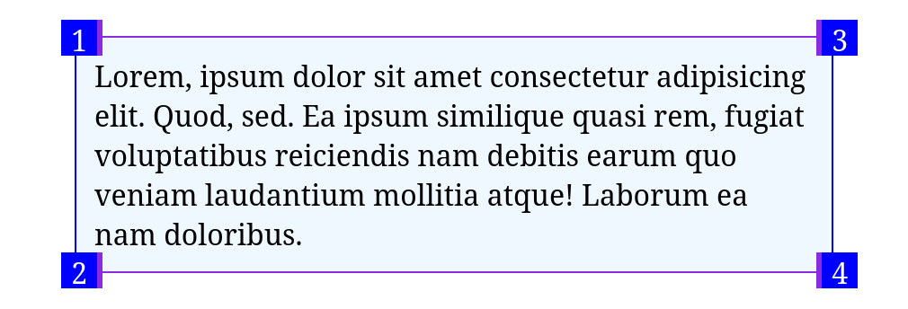 </div>

---

### Assignment 3

```html
<ul>
  <li class="beigeLI">
    HTML
    <ol class="firstOL" start="10">
      <li class="whiteLI">Slim</li>
      <li class="whiteLI">Pugjs</li>
      <li class="whiteLI">HAML</li>
    </ol>
  </li>

  <li class="beigeLI">
    CSS
    <ol class="secondOL" start="10">
      <li class="whiteLI">SASS</li>
      <li class="whiteLI">LESS</li>
      <li class="whiteLI">PostCSS</li>
    </ol>
  </li>

  <li class="beigeLI">
    JavaScript
    <ul class="lastUL">
      <li class="whiteLI">Vuejs</li>
      <li class="whiteLI">Sveltejs</li>
    </ul>
  </li>
</ul>
```

```css
ul {
  width: 400px;
}

ul,
ol {
  list-style: none;
}

.whiteLI {
  background-color: white;
  margin-bottom: 5px;
  padding-left: 10px;
}

.beigeLI {
  background-color: beige;
  padding: 10px;
  margin-bottom: 10px;
}

.firstOL {
  list-style: decimal;
}

.secondOL {
  list-style: upper-roman;
}

.lastUL {
  list-style: circle;
  list-style-position: inside;
  margin-left: -40px;
  margin-top: 10px;
  width: 100%;
}
```

<div style="display:flex; justify-content:center; align-items:center; gap:16px; flex-wrap:wrap;"> 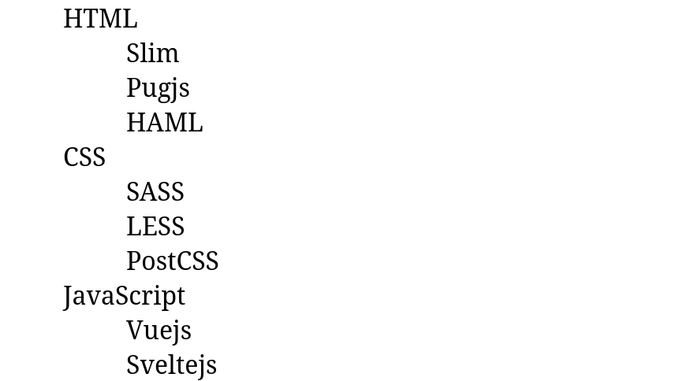 </div>

---

### Assignment 4

```css
/* TODO: Solve Later */
```

---

## Pseudo Classes, Pseudo Elements

### Assignment 1

```css
div {
  width: 300px;
  height: 60px;
  background-color: rgb(218, 216, 216);
  text-align: center;
  align-content: center;
  margin: 20px auto;
}

:empty {
  background-color: red;
}
```

<div style="display:flex; justify-content:center; align-items:center; gap:16px; flex-wrap:wrap;"> 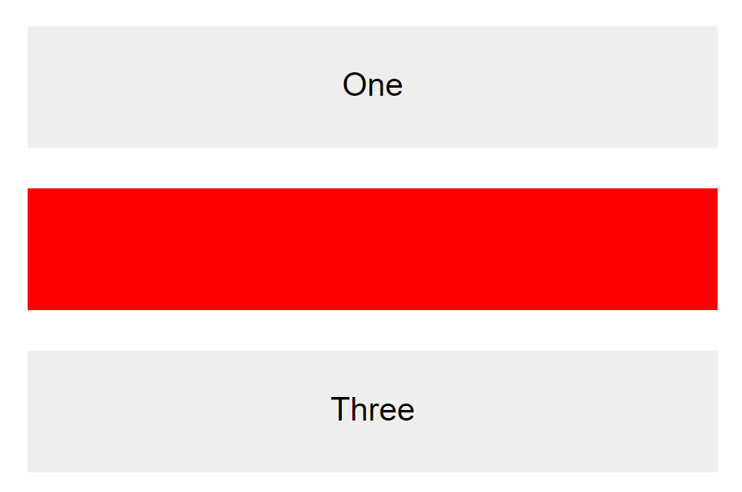 </div>

---

### Assignment 2

```css
div {
  align-items: center;
  background: #d3d3d3;
  padding: 20px 30px;
  margin: 20px auto;
  width: 500px;
  border: 1px solid #bbb;
  font-size: 22px;
  color: #222;
  position: relative;
}

div::first-letter {
  background-color: red;
  color: white;
  font-weight: bold;
  font-size: 26px;
  position: absolute;
  margin-left: -45px;
  border: 7px solid red;
  margin-right: 20px;
}
```

<div style="display:flex; justify-content:center; align-items:center; gap:16px; flex-wrap:wrap;"> 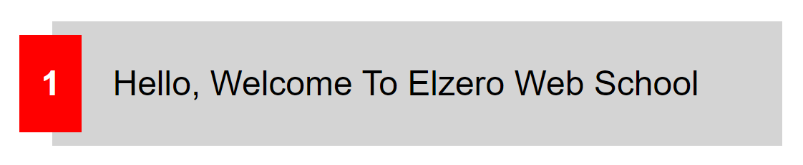 </div>

---

### Assignment 3

```css
.parent p {
  width: 75%;
  height: 50px;
  background-color: white;
  margin: 20px auto 20px 100px;
  position: relative;
  border-left: #e91e63 5px solid;
  align-content: center;
  padding-left: 15px;
}

.parent p::after {
  content: attr(data-person);
  position: absolute;
  left: -95px;
  top: 10%;
  width: 75px;
  height: 40px;
  text-align: center;
  align-content: center;
  background-color: white;
}

.parent p::before {
  content: "";
  position: absolute;
  left: -15px;
  top: 30%;
  width: 0;
  height: 0;
  border-top: 10px solid transparent;
  border-bottom: 10px solid transparent;
  border-right: 10px solid #e91e63;
}
```

<div style="display:flex; justify-content:center; align-items:center; gap:16px; flex-wrap:wrap;"> 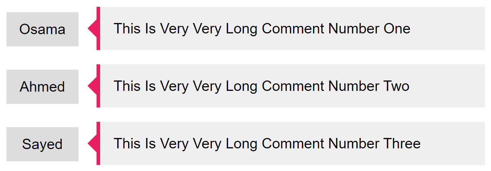 </div>

---

### Assignment 4

```css
.parent {
  counter-reset: members-counter;
}

.parent p {
  counter-increment: members-counter;
  position: relative;
  display: block;
  margin: 20px auto;
  width: 95%;
  height: 60px;
  background-color: white;
  padding-left: 80px;
  line-height: 60px;
  font-size: 1.1rem;
  border-right: 5px solid #e8412a;
}

.parent p::before {
  content: counter(members-counter);
  position: absolute;
  left: 0;
  top: 0;
  background-color: #e8412a;
  color: white;
  width: 60px;
  height: 60px;
  text-align: center;
  line-height: 60px;
  font-weight: bold;
  font-size: 1.3rem;
}
```

<div style="display:flex; justify-content:center; align-items:center; gap:16px; flex-wrap:wrap;"> 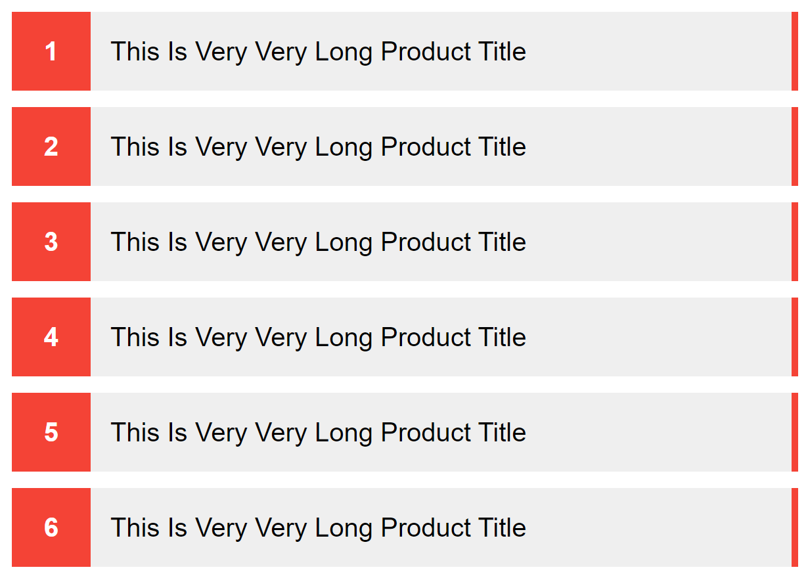 </div>

---

## Border Radius, Box Shadow

### Assignment 1

```css
.parent {
	width: 100%;
	display: flex;
	gap: 40px;
	counter-reset: circles-counter;
}

.parent div {
	counter-increment: circles-counter;
	margin: 20px auto;
	width: 100px;
	height: 100px;
	background-color: #ececec;
	border: black 2px solid;
	border-radius: 50%;
	box-shadow:
		-5px -5px 0px 0px #e71e62,
		5px 5px 0px 0px #2194f1;
	position: relative;
}

.parent div::before {
	position: absolute;
	content: counter(circles-counter);
	top: -12px;
	left: 50%;
	transform: translateX(-50%);
	background-color: black;
	width: 25px;
	height: 25px;
	color: white;
	text-align: center;
	align-content: center;
	font-weight: bold;
	border-radius: 50%;
}
	  
.parent div::after {
	position: absolute;
	content: "Element";
	top: 50%;
	left: 50%;
	transform: translate(-50%, -50%);
}
```

<div style="display:flex; justify-content:center; align-items:center; gap:16px; flex-wrap:wrap;"> 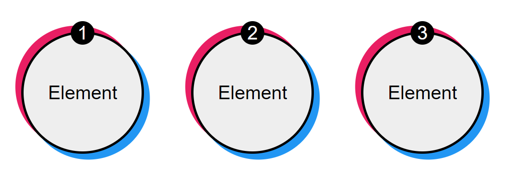 </div>

---

### Assignment 2

```css
.parent {
	width: 100%;
}

.parent div {
	margin: 20px auto;
	width: 100px;
	height: 100px;
	background-color: #ececec;
	border-radius: 50%;
	border-top-left-radius: 15px 30px;
	border-bottom-right-radius: 15px 30px;
	box-shadow: 0px 0px 10px inset #646464;
}
```

<div style="display:flex; justify-content:center; align-items:center; gap:16px; flex-wrap:wrap;"> 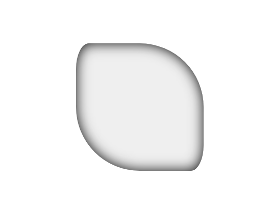 </div>

---

### Assignment 3

```css
/* TODO: Solve Later */
```

---

## Transitions, Variables

### Assignment 1

```css
.parent {
  display: flex;
  flex-direction: column;
  justify-content: center;
  align-items: center;
  gap: 40px;
  background-color: #f0f0f0;
  width: 800px;
  height: 450px;
  transition: transform 0.5s;
}

.parent:hover {
  transform: translateY(-20px);
}

.son {
  display: flex;
  justify-content: center;
  align-items: center;
  background-color: #dcdcdc;
  width: 700px;
  height: 120px;
  transition: transform 0.5s 0.5s;
}

.parent:hover .son {
  transform: translateY(20px);
}

p {
  font-size: 1.5rem;
  font-weight: bold;
}
```

<div style="display:flex; justify-content:center; align-items:center; gap:16px; flex-wrap:wrap;"> 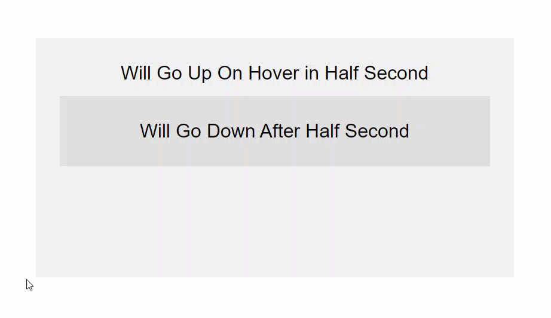 </div>

---

### Assignment 2

```css
div {
  background-color: azure !important;
  color: black !important;
  width: 75vh !important;
  margin: 0 auto !important;
  align-content: center;
  text-align: center;
  text-indent: -99999px;
}

div::after {
  content: "Elzero";
  display: block;
  text-indent: 0;
  margin-top: -100px;
  font-size: 80px;
  color: black;
}
```

<div style="display:flex; justify-content:center; align-items:center; gap:16px; flex-wrap:wrap;">  </div>

---

### Assignment 3

```css
:root {
  --mainColor: #009688;
  --mainPadding: 10px;
}

div {
  width: 75vh;
  height: 50px;
  color: var(--mainColor, red);
  border: 2px solid var(--mainColor, black);
  padding: var(--mainPadding, 10px);
  margin: 20px auto;
  align-content: center;
}
```

<div style="display:flex; justify-content:center; align-items:center; gap:16px; flex-wrap:wrap;"> 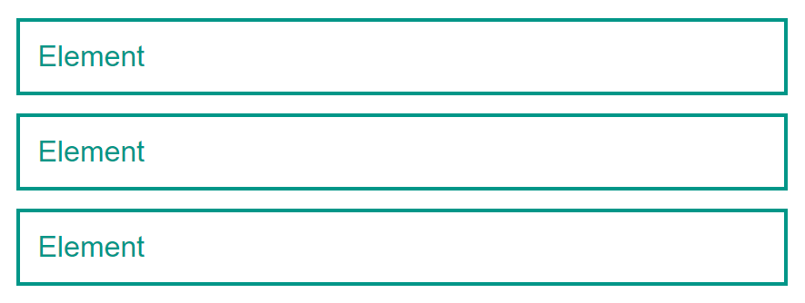 </div>

---

## Flex Box

### Assignment 1

```css
main {
  display: flex;
  align-items: center;
  justify-content: center;
}

div {
  width: 300px;
  height: 300px;
  border-radius: 50%;
  background: #e8e8e8;
  font-size: 2.5rem;
  font-weight: 700;
  color: #ff5733;
  display: flex;
  align-items: center;
  justify-content: center;
}

div::after,
div::before {
  content: "";
  position: absolute;
  width: 300px;
  height: 300px;
  border-radius: 50%;
}

div::before {
  right: 330px;
  background-color: #ff5733;
  z-index: -2;
}

div::after {
  left: 340px;
  background-color: #03a9f4;
  z-index: -1;
}
```

<div style="display:flex; justify-content:center; align-items:center; gap:16px; flex-wrap:wrap;"> 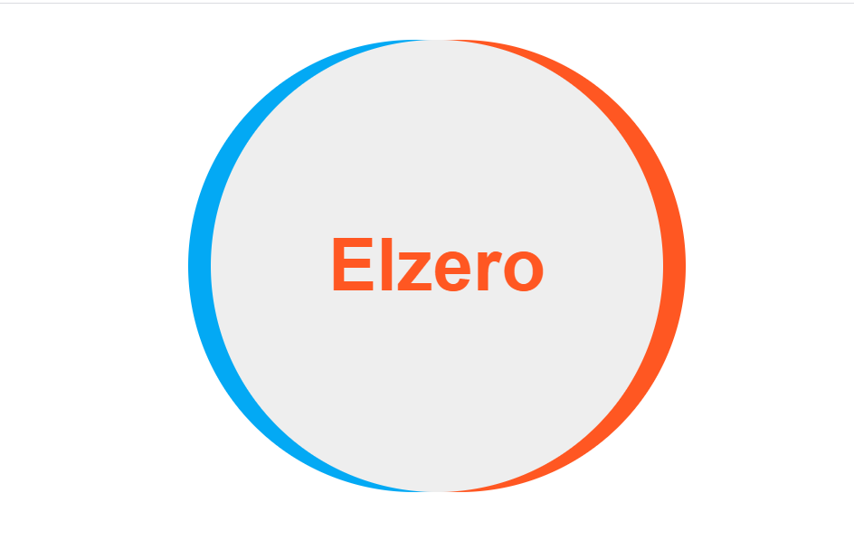 </div>

---

### Assignment 2

```css
main {
  width: 100vh;
  height: 100vh;
  display: flex;
  justify-content: center;
}

.parent {
  width: 600px;
  height: 300px;
  margin: auto;
  padding: 10px;
  background-color: #eeeeee;
  display: flex;
  flex-wrap: wrap;
  justify-content: space-evenly;
  align-content: space-between;
}

.parent div {
  width: 180px;
  height: 50px;
  background: #e74c3c;
  color: white;
  display: flex;
  align-items: center;
  justify-content: center;
}
```

<div style="display:flex; justify-content:center; align-items:center; gap:16px; flex-wrap:wrap;"> 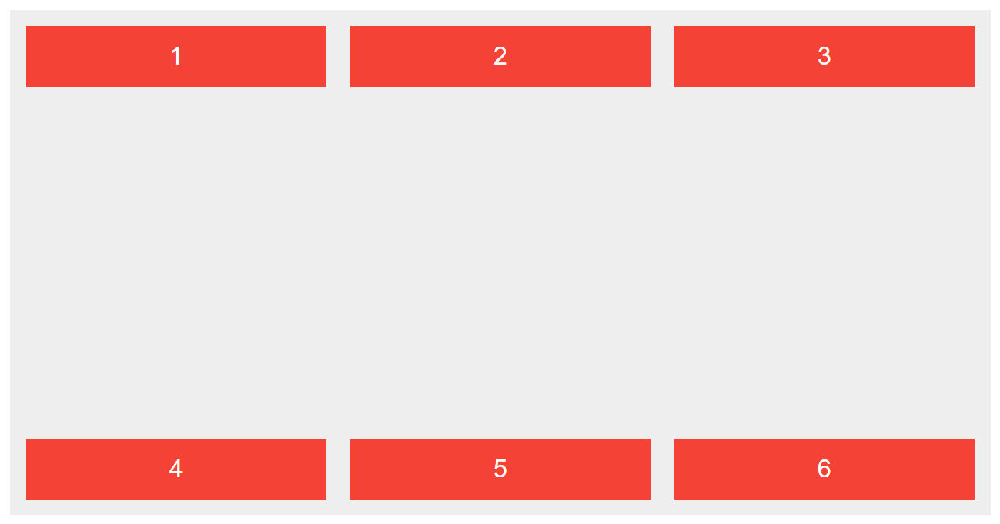 </div>

---

### Assignment 3

```css
.parent {
  width: 600px;
  height: 300px;
  margin: auto;
  padding: 10px;
  background-color: #eeeeee;
  display: flex;
  flex-flow: row wrap;
  justify-content: space-between;
}

.parent div {
  width: calc(95% / 3);
  min-height: 40px;
  background-color: #607d8b;
  color: white;
  display: flex;
  align-items: center;
  justify-content: center;
  text-align: center;
}

.one {
  order: 6;
  align-self: flex-end;
}

.two {
  order: 5;
}

.five {
  order: 4;
}

.four {
  order: 3;
}

.three {
  order: 2;
  align-self: flex-start;
}
```

<div style="display:flex; justify-content:center; align-items:center; gap:16px; flex-wrap:wrap;"> 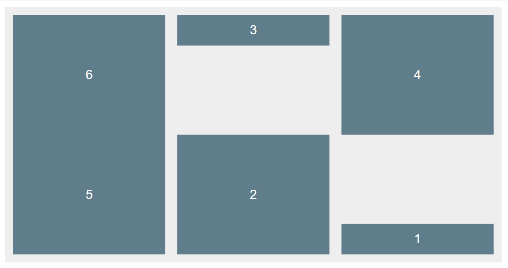 </div>

---

### Assignment 4

```css
.parent {
  width: 600px;
  height: 300px;
  margin: auto;
  padding: 10px;
  background-color: #eeeeee;
  display: flex;
  flex-flow: column wrap;
  justify-content: space-between;
  align-items: flex-end;
}

.parent div {
  height: calc(95% / 3);
  min-height: 40px;
  background-color: #009688;
  color: white;
  display: flex;
  align-items: center;
  justify-content: center;
  text-align: center;
}

.one {
  width: 5%;
}

.two {
  width: 50%;
  align-self: flex-start;
}

.three {
  width: 5%;
}
```

<div style="display:flex; justify-content:center; align-items:center; gap:16px; flex-wrap:wrap;"> 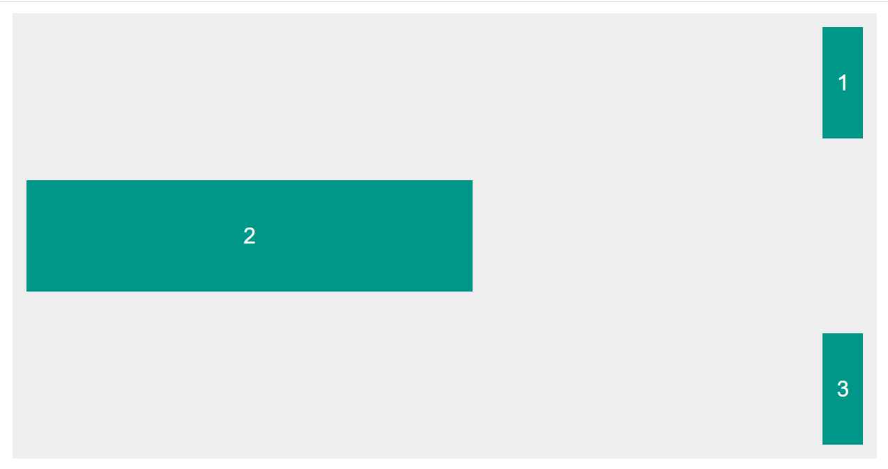 </div>

---

### Assignment 5

```css
.parent {
  width: 600px;
  height: 300px;
  margin: auto;
  padding: 10px;
  background-color: #eeeeee;
  display: flex;
  flex-flow: row-reverse wrap;
  justify-content: space-between;
}

.parent div {
  width: calc(95% / 6);
  height: 50%;
  color: white;
  display: flex;
  align-items: center;
  justify-content: center;
  text-align: center;
}

.one,
.three {
  align-self: flex-start;
}

.two,
.four {
  align-self: flex-end;
}

.one {
  order: 3;
  background-color: #ff9800;
}

.three {
  order: 1;
  background-color: #795548;
}

.two {
  order: 2;
  background-color: #8bc34a;
}

.four {
  order: 4;
  background-color: #673ab7;
}
```

<div style="display:flex; justify-content:center; align-items:center; gap:16px; flex-wrap:wrap;"> 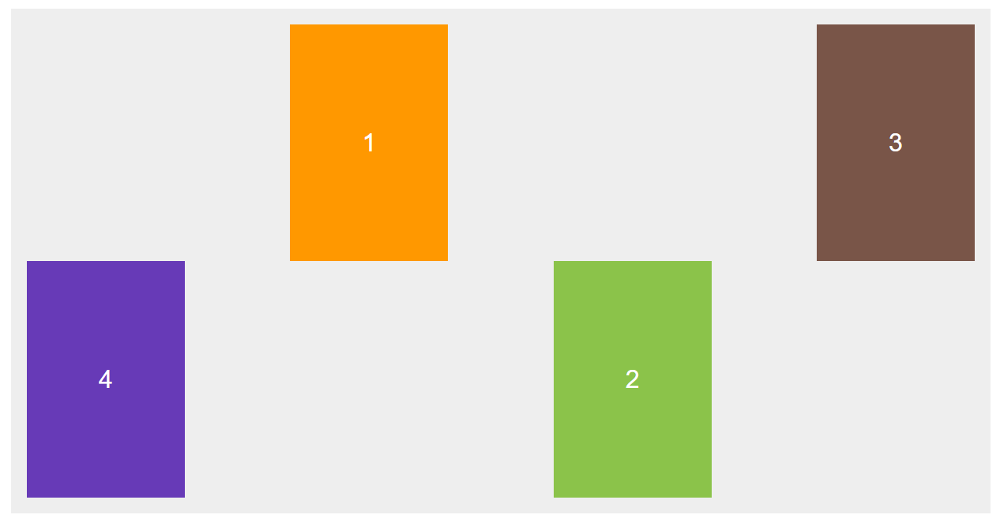 </div>

---

### Assignment 6

```css
:root {
  --bg-color: #e0e0e0;
  --gap: 10px;
  --padding: 15px;
}

* {
  margin: 0;
  padding: 0;
  box-sizing: border-box;
}

.page {
  display: flex;
  flex-direction: column;
  background-color: #eeeeee;
  min-height: 100vh;
  width: 100%;
}

.header {
  display: flex;
  align-items: stretch;
  gap: var(--gap);
  margin-bottom: 10px;
}

.header .logo {
  background-color: var(--bg-color);
  min-width: 120px;
  padding: var(--padding);
  display: flex;
  align-items: center;
  justify-content: center;
}

.header .links {
  list-style: none;
  background-color: var(--bg-color);
  display: flex;
  flex-grow: 1;
  align-items: center;
  justify-content: flex-end;
  gap: 20px;
  padding: var(--padding);
}

.main-area {
  display: flex;
  gap: var(--gap);
  margin-bottom: 10px;
}

.main-area .content {
  background-color: var(--bg-color);
  padding: var(--padding);
  min-height: 500px;
  flex-grow: 3;
}

.main-area .sidebar {
  background-color: var(--bg-color);
  padding: var(--padding);
  flex-grow: 1;
}

.footer {
  background: var(--bg-color);
  display: flex;
  justify-content: space-between;
  align-items: center;
  padding: var(--padding);
}
```

<div style="display:flex; justify-content:center; align-items:center; gap:16px; flex-wrap:wrap;"> 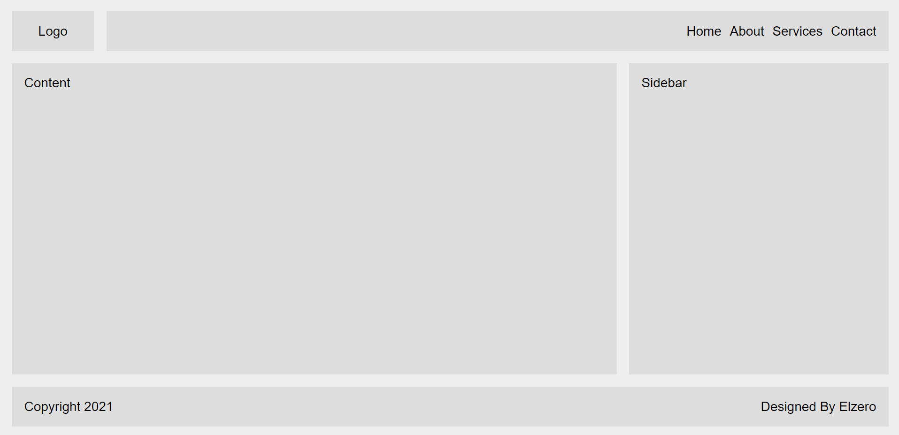 </div>

---

## Filters, Gradient

### Assignment 1

```css
:root {
  --bg-color: #e0e0e0;
  --gap: 10px;
  --padding: 15px;
}

* {
  margin: 0;
  padding: 0;
  box-sizing: border-box;
}

main {
  display: flex;
  justify-content: center;
  align-items: center;
}

div {
  width: 600px;
  height: 50px;
  background-color: var(--bg-color);
  position: relative;
  display: flex;
  align-items: center;
  justify-content: center;
  font-weight: bold;
  font-size: 30px;
  letter-spacing: 10px;
  border-left: 10px solid #f44336;
  border-right: 10px solid #673ab7;
}

div p::first-letter {
  color: #f44336;
}

div::before {
  content: "";
  position: absolute;
  top: -10px;
  left: -10px;
  width: calc(100% + 20px);
  height: 10px;
  background-image: linear-gradient(
    to right,
    #f44336 20%,
    #2095f2 20%,
    #2095f2 40%,
    #51af55 40%,
    #51af55 60%,
    #e91e63 60%,
    #e91e63 80%,
    #673ab7 80%
  );
}

div::after {
  content: "";
  position: absolute;
  bottom: -10px;
  right: -10px;
  width: calc(100% + 20px);
  height: 10px;
  background-image: linear-gradient(
    to right,
    #f44336 20%,
    #2095f2 20%,
    #2095f2 40%,
    #51af55 40%,
    #51af55 60%,
    #e91e63 60%,
    #e91e63 80%,
    #673ab7 80%
  );
}
```

<div style="display:flex; justify-content:center; align-items:center; gap:16px; flex-wrap:wrap;"> 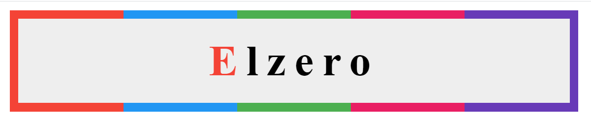 </div>

---

### Assignment 2

```css
:root {
  --bg-color: #e0e0e0;
  --gap: 10px;
  --padding: 15px;
}

* {
  margin: 0;
  padding: 0;
  box-sizing: border-box;
}

main {
  display: flex;
  justify-content: center;
  align-items: center;
  flex-direction: column;
  gap: 50px;
}

div {
  width: 600px;
  height: 50px;
  background-color: var(--bg-color);
  position: relative;
  display: flex;
  align-items: center;
  font-weight: bold;
  font-size: 30px;
  padding-left: 20px;
}

div::after {
  content: "";
  position: absolute;
  bottom: 0;
  right: 0;
  width: 100%;
  height: 2px;
  background-image: linear-gradient(to right, #f44336 50%, #008e7f 50%);
}

.one {
  caret-color: #f44336;
  pointer-events: all;
}

.two,
.three {
  pointer-events: none;
  color: rgba(0, 0, 0, 0.2);
}
```

<div style="display:flex; justify-content:center; align-items:center; gap:16px; flex-wrap:wrap;"> 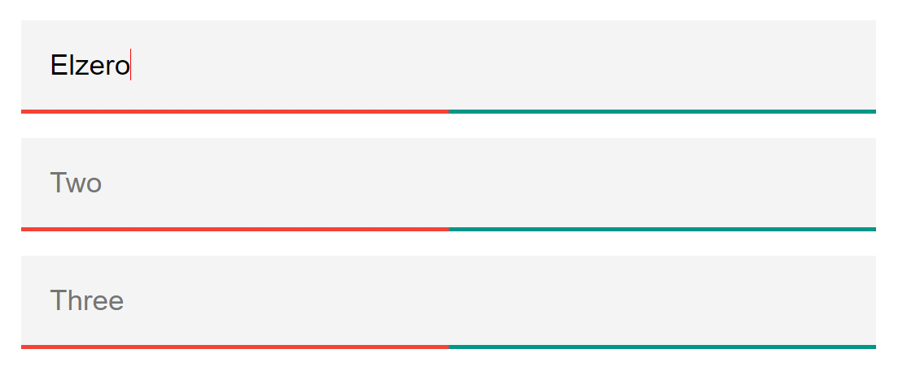 </div>

---

## Grid

### Assignment 1

```css
:root {
  --bg-color: #e0e0e0;
  --gap: 10px;
  --padding: 15px;
}

* {
  margin: 0;
  padding: 0;
  box-sizing: border-box;
}

main {
  display: flex;
  justify-content: center;
  align-items: center;
}

.grid {
  background-color: #ddd;
  padding: 20px;
  width: 800px;
  height: 400px;
  display: grid;
  grid-template-columns: repeat(3, 1fr);
  grid-template-rows: 50px 1fr;
  gap: 10px;
  margin: 0 auto;
}

.grid div {
  background-color: #607d8b;
  display: flex;
  align-items: center;
  justify-content: center;
  font-weight: bold;
  color: white;
}

.grid div:nth-child(1)::after { content: "Element 1"; }
.grid div:nth-child(2)::after { content: "Element 2"; }
.grid div:nth-child(3)::after { content: "Element 3"; }
.grid div:nth-child(4)::after { content: "Element 4"; }
.grid div:nth-child(5)::after { content: "Element 5"; }
.grid div:nth-child(6)::after { content: "Element 6"; }
```

<div style="display:flex; justify-content:center; align-items:center; gap:16px; flex-wrap:wrap;"> 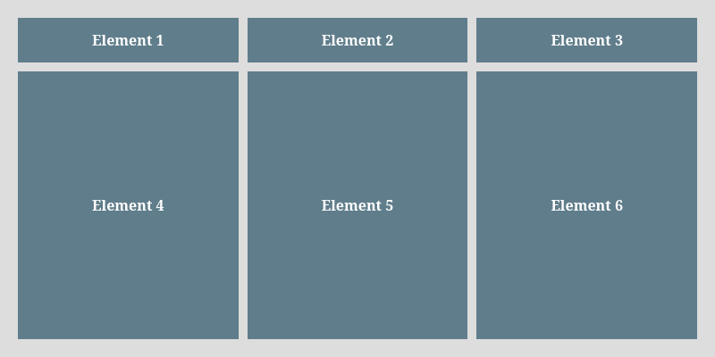 </div>

---

### Assignment 2

```css
:root {
  --bg-color: #e0e0e0;
  --gap: 10px;
  --padding: 15px;
}

* {
  margin: 0;
  padding: 0;
  box-sizing: border-box;
}

.layout {
  display: grid;
  grid-template-columns: 1fr 160px;
  grid-template-rows: auto 1fr auto;
  grid-template-areas:
    "header header"
    "section aside"
    "footer footer";
  height: 100vh;
}

header {
  grid-area: header;
  background-color: #03a9f4;
  padding: 10px;
}

section {
  grid-area: section;
  background-color: #ff5722;
  padding: 10px;
}

aside {
  grid-area: aside;
  background-color: #607d8b;
  padding: 10px;
}

footer {
  grid-area: footer;
  background-color: #009688;
  padding: 10px;
}

header::after { content: "Header"; color: white; }
section::after { content: "Section"; color: white; }
aside::after { content: "Aside"; color: white; }
footer::after { content: "Footer"; color: white; }
```

<div style="display:flex; justify-content:center; align-items:center; gap:16px; flex-wrap:wrap;"> 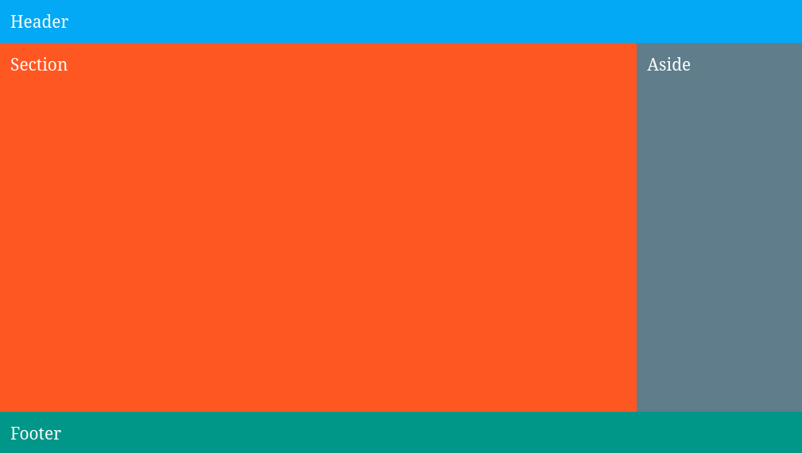 </div>

---

### Assignment 3

```css
:root {
  --bg-color: #e0e0e0;
  --gap: 10px;
  --padding: 15px;
}

* {
  margin: 0;
  padding: 0;
  box-sizing: border-box;
}

main {
  display: flex;
  justify-content: center;
}

.grid {
  background-color: #ddd;
  padding: 20px;
  width: 800px;
  height: 400px;
  display: grid;
  grid-template-columns: auto repeat(2, 1fr) auto;
  grid-template-rows: 1fr auto;
  gap: 20px;
}

.grid div {
  background-color: #403f3f;
  color: white;
  display: flex;
  align-items: center;
  justify-content: center;
}
```

<div style="display:flex; justify-content:center; align-items:center; gap:16px; flex-wrap:wrap;"> 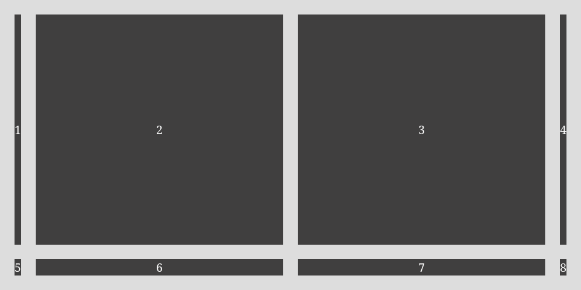 </div>

---

### Assignment 4

```css
.grid {
  background-color: #ddd;
  padding: 20px;
  width: 800px;
  height: 400px;
  display: grid;
  grid-template-areas:
    "eight eight eight"
    "two two three"
    "four five five"
    "six five five"
    "seven five five"
    "one one one";
  gap: 20px;
}

.grid div {
  background-color: #2196f3;
  color: white;
  font-weight: bold;
  font-size: 15px;
  display: flex;
  align-items: center;
  justify-content: center;
}

.one { grid-area: one; }
.two { grid-area: two; }
.three { grid-area: three; }
.four { grid-area: four; }
.five { grid-area: five; }
.six { grid-area: six; }
.seven { grid-area: seven; }
.eight { grid-area: eight; }
```

<div style="display:flex; justify-content:center; align-items:center; gap:16px; flex-wrap:wrap;"> 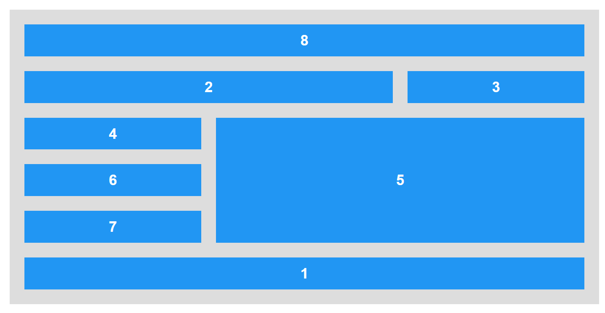 </div>

---

### Assignment 5

```css
.grid {
  background-color: #ddd;
  padding: 20px;
  width: 800px;
  height: 400px;
  display: grid;
  grid-template-columns: repeat(2, 1fr);
  grid-template-rows: auto 1fr auto;
  grid-template-areas:
    "one two"
    ". ."
    "three four";
  gap: 20px;
}

.grid div {
  background-color: #e91e63;
  color: white;
  font-weight: bold;
  font-size: 15px;
  display: flex;
  align-items: center;
  justify-content: center;
}

.grid :nth-child(1) { grid-area: one; }
.grid :nth-child(2) { grid-area: two; }
.grid :nth-child(3) { grid-area: three; }
.grid :nth-child(4) { grid-area: four; }
```

<div style="display:flex; justify-content:center; align-items:center; gap:16px; flex-wrap:wrap;"> 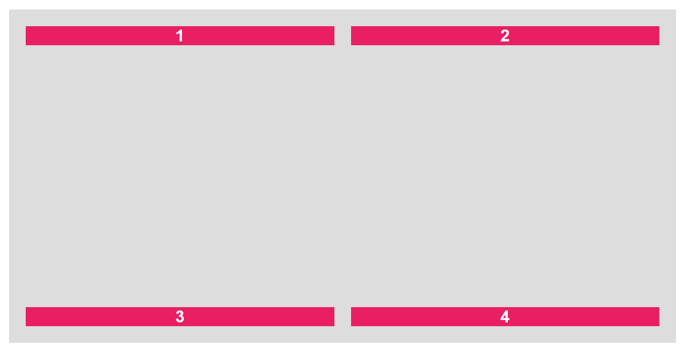 </div>

---

### Assignment 6

---

## Scale, Rotate, Translate

### Assignment 1

```css
div {
  position: relative;
  width: 300px;
  height: 200px;
  background-color: #eeeeee;
  display: flex;
  align-items: center;
  justify-content: center;
  font-size: 30px;
  font-weight: bold;
  color: #03a9f4;
  border: 0.1px solid #c3c3c3;
}

div::before {
  content: " ";
  background-color: #e91e63;
  position: absolute;
  width: 300px;
  height: 200px;
  transform: rotate(5deg);
  z-index: -1;
}

div::after {
  content: " ";
  background-color: #03a9f4;
  position: absolute;
  width: 300px;
  height: 200px;
  transform: rotate(-5deg);
  z-index: -2;
}
```

<div style="display:flex; justify-content:center; align-items:center; gap:16px; flex-wrap:wrap;"> 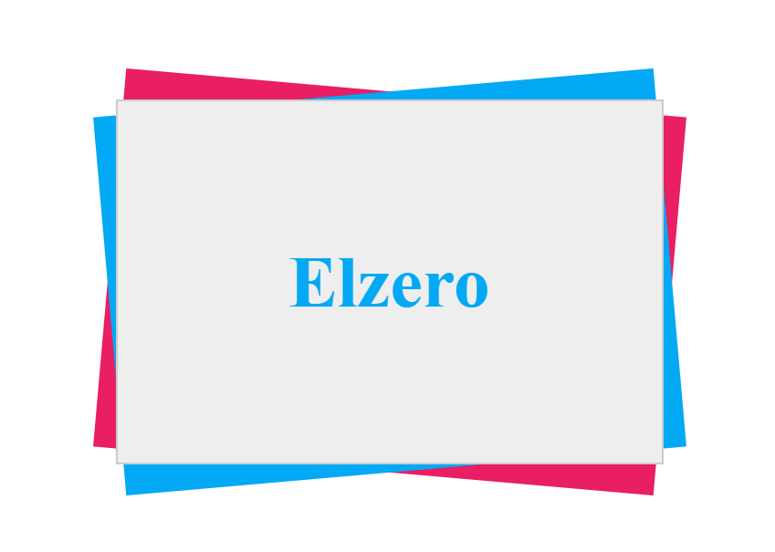 </div>

---

### Assignment 2

```css
div {
  position: relative;
  width: 200px;
  height: 200px;
  border-radius: 50%;
  background-color: #eeeeee;
  position: absolute;
  top: 50%;
  left: 50%;
  transform: translate(-50%, -50%);
  display: flex;
  align-items: center;
  justify-content: center;
  font-size: 30px;
  font-weight: bold;
  border: 0.1px solid #c3c3c3;
}

div::before {
  content: " ";
  position: absolute;
  width: 200px;
  height: 200px;
  border-radius: 50%;
  border: 10px solid #e91e63;
  border-left-color: transparent;
  z-index: -1;
}

div::after {
  content: " ";
  position: absolute;
  width: 220px;
  height: 220px;
  border-radius: 50%;
  border: 10px solid #2196f3;
  border-right-color: transparent;
  z-index: -2;
}
```

<div style="display:flex; justify-content:center; align-items:center; gap:16px; flex-wrap:wrap;"> 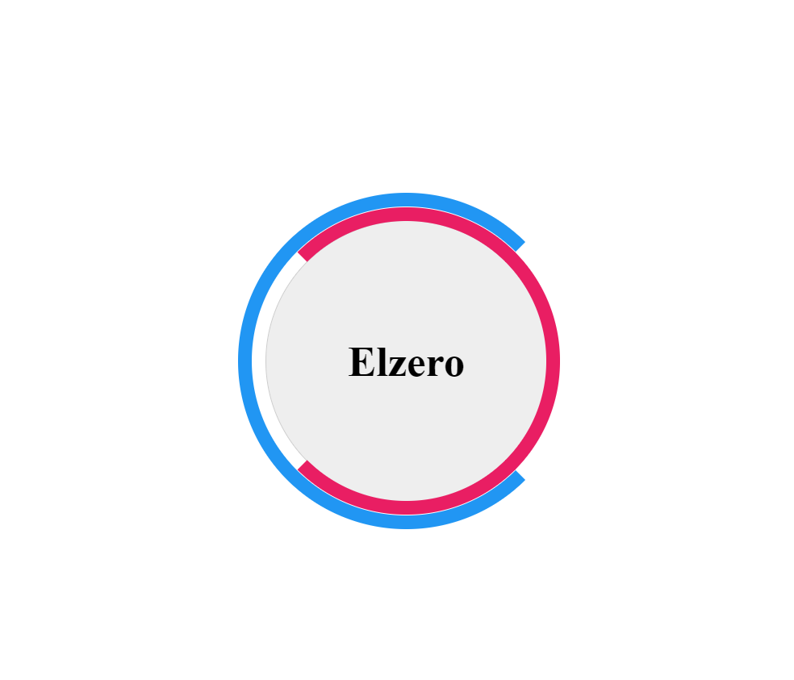 </div>

---

### Assignment 3

```css
div {
  position: relative;
  width: 200px;
  height: 200px;
  border-radius: 50%;
  background-color: #eeeeee;
  position: absolute;
  top: 50%;
  left: 50%;
  transform: translate(-50%, -50%);
  display: flex;
  align-items: center;
  justify-content: center;
  font-size: 30px;
  font-weight: bold;
  border: 0.1px solid #c3c3c3;
}

div::before,
div::after {
  content: " ";
  position: absolute;
  border-radius: 50%;
}

div::before {
  width: 200px;
  height: 200px;
  border: 10px solid #e91e63;
  border-left-color: transparent;
  transition: transform 0.3s linear;
  z-index: -1;
}

div::after {
  width: 220px;
  height: 220px;
  border: 10px solid #2196f3;
  border-right-color: transparent;
  transition: transform 0.3s linear 0.3s;
  z-index: -2;
}

div:hover::before,
div:hover::after {
  transform: rotate(360deg);
}
```

<div style="display:flex; justify-content:center; align-items:center; gap:16px; flex-wrap:wrap;"> 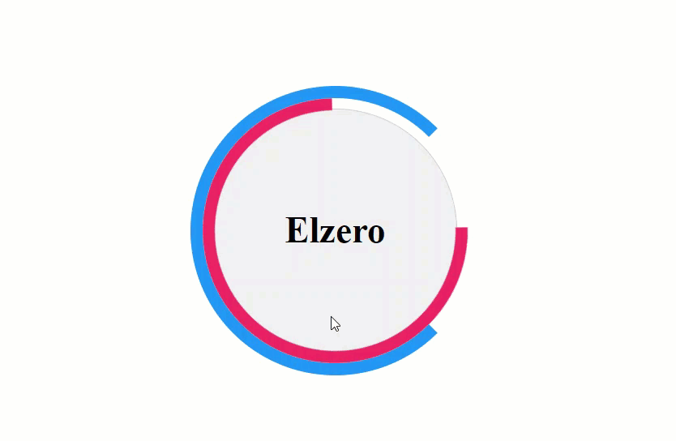 </div>

---

## Skew, Matrix, 3D Transform

### Assignment 1

```css
h1 {
  position: relative;
  width: 150px;
  background-color: #ff5722;
  display: flex;
  align-items: center;
  justify-content: center;
  color: white;
}

h1::before {
  content: '';
  position: absolute;
  width: 100%;
  height: 100%;
  background-color: #ff5722;
  top: 0;
  left: 0;
  transform-origin: center center;
  transform: skew(10deg, 10deg);
  z-index: -1;
}

h1::after {
  content: '';
  position: absolute;
  width: 100%;
  height: 100%;
  background-color: #ff5722;
  bottom: 0;
  right: 0;
  transform-origin: center center;
  transform: skew(-10deg, -10deg);
  z-index: -1;
}
```

<div style="display:flex; justify-content:center; align-items:center; gap:16px; flex-wrap:wrap;">  </div>

---

### Assignment 2

```css
h1 {
  position: relative;
  width: 130px;
  background-color: #009688;
  display: flex;
  align-items: center;
  justify-content: center;
  color: white;
}

h1::before {
  content: '';
  position: absolute;
  width: 7%;
  height: 100%;
  background-color: #009688;
  top: 0;
  left: -20px;
  transform-origin: center center;
  transform: skewX(15deg);
  z-index: -1;
}

h1::after {
  content: '';
  position: absolute;
  width: 10%;
  height: 100%;
  background-color: #009688;
  bottom: 0;
  right: 124px;
  transform-origin: center center;
  transform: skewX(15deg);
  z-index: -1;
}
```

<div style="display:flex; justify-content:center; align-items:center; gap:16px; flex-wrap:wrap;">  </div>

---

### Assignment 3

```css
.class {
  transform: matrix(3, 0.2679, 0, 3, 20, 100);
  /*
    scaleX(3)
    skewY(0.2679)
    skewX(0)
    scaleY(3)
    translateX(20)
    translateY(100)
  */
}
```

---

### Assignment 5

```css
:root {
  --bg-color: #e0e0e0;
  --gap: 10px;
  --padding: 15px;
  --main-color: #f44a12;
}

* {
  margin: 0;
  padding: 0;
  box-sizing: border-box;
}

main {
  display: flex;
  justify-content: center;
  align-items: center;
}

div {
  width: 200px;
  height: 200px;
  position: relative;
  transform-style: preserve-3d;
  transition: transform 0.8s ease;
  cursor: pointer;
}

div:hover {
  transform: rotateX(180deg);
}

div::before {
  content: 'Front';
  position: absolute;
  width: 100%;
  height: 100%;
  background-color: #fa3664;
  color: white;
  display: flex;
  align-items: center;
  justify-content: center;
  backface-visibility: hidden;
}

div::after {
  content: 'Back';
  position: absolute;
  width: 100%;
  height: 100%;
  background-color: #1692fc;
  color: white;
  display: flex;
  align-items: center;
  justify-content: center;
  backface-visibility: hidden;
  transform: rotateX(180deg);
}
```

<div style="display:flex; justify-content:center; align-items:center; gap:16px; flex-wrap:wrap;"> 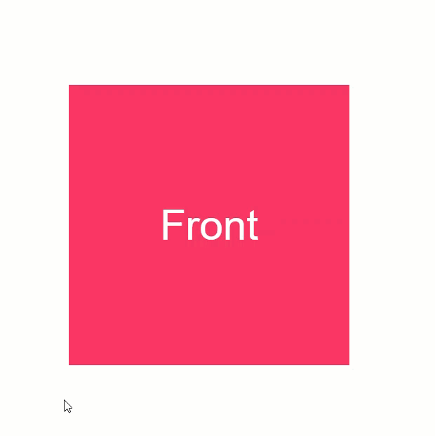 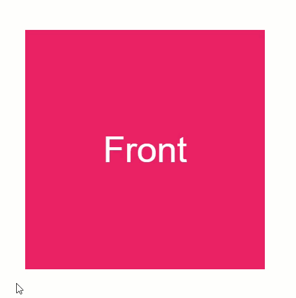 </div>

---

## Animation

### Assignment 1

```css
div {
  width: 55px;
  height: 55px;
  position: relative;
  border: 4px solid #de2455;
  border-radius: 50%;
  border-left-color: transparent;
  transform: rotate(60deg);
  animation: spin 1s infinite linear;
  animation-play-state: running;
}

div:hover {
  animation-play-state: paused;
}

@keyframes spin {
  0%   { transform: rotate(0deg); }
  100% { transform: rotate(360deg); }
}

div::before {
  content: '';
  position: absolute;
  width: 55px;
  height: 55px;
  top: -8px;
  left: -8px;
  border: 4px solid #1090ff;
  border-radius: 50%;
  border-right-color: transparent;
}

div::after {
  content: '';
  position: absolute;
  width: 63px;
  height: 63px;
  top: -12px;
  left: -12px;
  border: 4px solid #fc9400;
  border-radius: 50%;
  border-top-color: transparent;
}
```

<div style="display:flex; justify-content:center; align-items:center; gap:16px; flex-wrap:wrap;"> 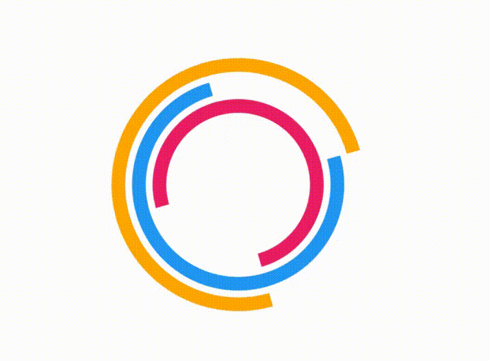 </div>

---

### Assignment 2

```css
div {
  width: 55px;
  height: 55px;
  position: relative;
  border: 4px solid #2399ff;
  border-radius: 50%;
  border-bottom-color: transparent;
  animation: spin 1s infinite linear;
  animation-play-state: paused;
}

div::before {
  content: '';
  position: absolute;
  width: 55px;
  height: 55px;
  top: -8px;
  left: -8px;
  border: 4px solid #fc9400;
  border-radius: 50%;
  border-bottom-color: transparent;
  animation: spin 2s infinite linear;
  animation-play-state: paused;
}

div::after {
  content: '';
  position: absolute;
  width: 63px;
  height: 63px;
  top: -12px;
  left: -12px;
  border: 4px solid black;
  border-radius: 50%;
  border-bottom-color: transparent;
  animation: spin 3s infinite linear;
  animation-play-state: paused;
}

div:hover,
div:hover::before,
div:hover::after {
  animation-play-state: running;
}

@keyframes spin {
  0%   { transform: rotate(0deg); }
  100% { transform: rotate(360deg); }
}
```

<div style="display:flex; justify-content:center; align-items:center; gap:16px; flex-wrap:wrap;"> 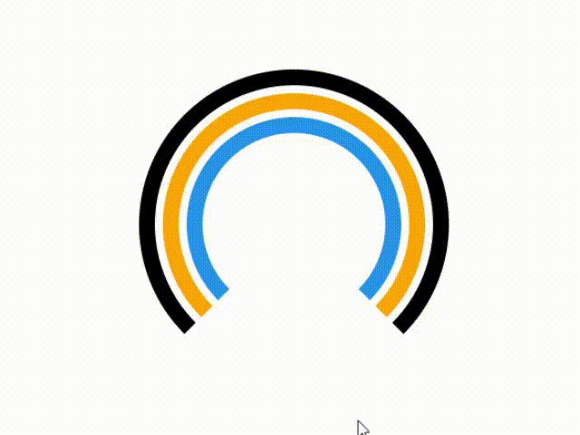 </div>

---

### Assignment 3

```css
span {
  width: 50px;
  height: 50px;
  position: relative;
  background-color: #e0e0e0;
  border: 4px solid #000000;
  border-radius: 50%;
  border-bottom-color: transparent;
  animation: spin 1s infinite ease-in-out;
  animation-play-state: running;
}
```

<div style="display:flex; justify-content:center; align-items:center; gap:16px; flex-wrap:wrap;"> 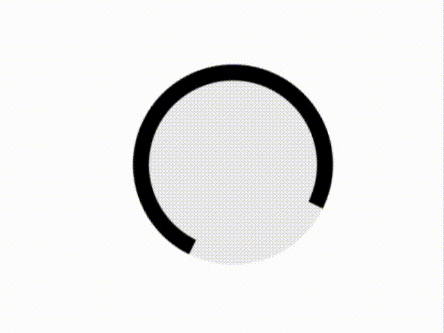 </div>

---

### Assignment 4

```html
<!-- E Letter -->
<div class="letter-e">
  <div class="e-accent"></div>
  <div class="e-top"></div>
  <div class="e-left-t"></div>
  <div class="e-gap"></div>
  <div class="e-mid"></div>
  <div class="e-gap"></div>
  <div class="e-left-b"></div>
  <div class="e-bot"></div>
</div>

<!-- L Letter -->
<div class="letter-l">
  <div class="l-accent"></div>
  <div class="l-top"></div>
  <div class="l-bot"></div>
</div>
```

```css
.letter-l,
.letter-e {
  display: grid;
  grid-template-columns: 20px 60px;
  grid-template-rows: repeat(7, 20px);
  margin: 5px;
  position: relative;
}

.letter-e div,
.letter-l div {
  background-color: #333;
}

.e-top {
  grid-column: 1 / 3;
  grid-row: 1;
}

.e-left-t {
  grid-column: 1;
  grid-row: 2;
}

.e-gap {
  grid-column: 1;
}

.e-mid {
  grid-column: 1 / 3;
  grid-row: 4;
}

.e-left-b {
  grid-column: 1;
  grid-row: 6;
}

.e-bot {
  grid-column: 1 / 3;
  grid-row: 7;
}

.l-top {
  grid-column: 1;
  grid-row: 1 / 7;
}

.l-bot {
  grid-column: 1 / 3;
  grid-row: 7;
}

.letter-e .e-accent,
.letter-l .l-accent {
  position: absolute;
  width: 10px;
  height: 10px;
  background-color: #fc9400;
  z-index: 1;
}

.letter-e .e-accent {
  top: 5px;
  left: calc(100% - 15px);
  animation: move-e 4s linear 2s 1 both;
  opacity: 0;
}

@keyframes move-e {
  0%  { opacity: 0; }
  10% { top: 5px;   left: calc(100% - 15px); opacity: 1; }
  20% { top: 5px;   left: 5px; }
  30% { top: 65px;  left: 5px; }
  40% { top: 65px;  left: calc(100% - 15px); }
  50% { top: 65px;  left: 5px; }
  60% { top: 125px; left: 5px; }
  70% { top: 125px; left: calc(100% - 15px); }
  80% { top: 125px; left: 5px; }
  90% { top: 5px;   left: 5px; }
  100%{ top: 5px;   left: calc(100% - 15px); opacity: 1; }
}

.letter-l .l-accent {
  bottom: 5px;
  right: 5px;
  animation: move-l 2s linear 1 both;
}

@keyframes move-l {
  0%  { bottom: 5px; right: 5px; }
  25% { bottom: 5px; right: calc(100% - 15px); }
  70% { right: calc(100% - 15px); bottom: calc(100% - 15px); opacity: 1; }
  100%{ right: calc(100% - 15px); bottom: calc(100% - 15px); opacity: 0; }
}
```

<div style="display:flex; justify-content:center; align-items:center; gap:16px; flex-wrap:wrap;">
  
</div>

---

## Selectors

### Assignment 1

```css
div.main.red {
  color: red;
}
```

<div style="display:flex; justify-content:center; align-items:center; gap:16px; flex-wrap:wrap;"> 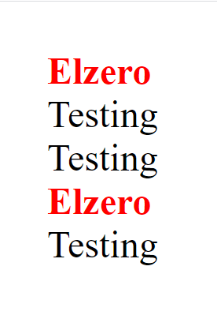 </div>

---

### Assignment 2

```css
.parent .child:nth-child(2) {
  color: red;
}
```

<div style="display:flex; justify-content:center; align-items:center; gap:16px; flex-wrap:wrap;"> 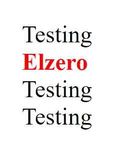 </div>

---

### Assignment 3

```css
div.parent:nth-child(2) .baby {
  color: red;
}
```

<div style="display:flex; justify-content:center; align-items:center; gap:16px; flex-wrap:wrap;"> 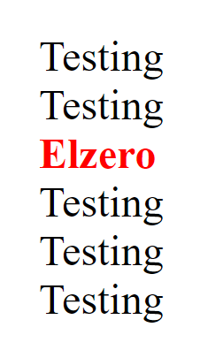 </div>

---

### Assignment 4

```css
main > div[title]:not(.no-need) {
  color: red;
}
```

<div style="display:flex; justify-content:center; align-items:center; gap:16px; flex-wrap:wrap;"> 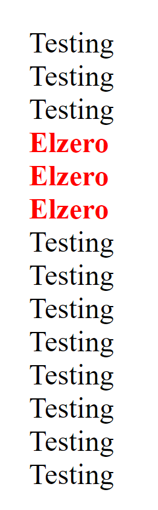 </div>

---

### Assignment 5

```css
main > div:nth-child(2) div[title] {
  color: red;
}
```

<div style="display:flex; justify-content:center; align-items:center; gap:16px; flex-wrap:wrap;"> 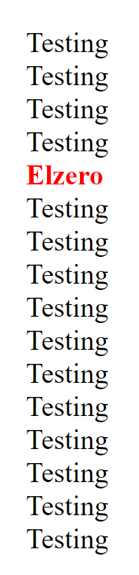 </div>

---

### Assignment 6

```css
main > div:not(:nth-child(3)) div:nth-last-of-type(2) {
  color: red;
}
```

<div style="display:flex; justify-content:center; align-items:center; gap:16px; flex-wrap:wrap;"> 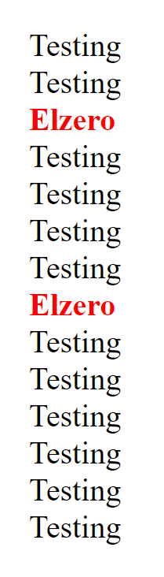 </div>

---

### Assignment 7

```css
main > div:nth-child(1) div:nth-last-child(2) {
  color: red;
}
```

<div style="display:flex; justify-content:center; align-items:center; gap:16px; flex-wrap:wrap;"> 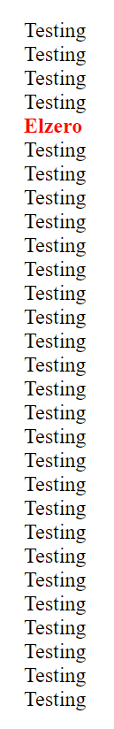 </div>

---

### Assignment 8

```css
main > div > *:not(h3):not(:first-child):not(:last-child) {
  color: red;
}
```

<div style="display:flex; justify-content:center; align-items:center; gap:16px; flex-wrap:wrap;"> 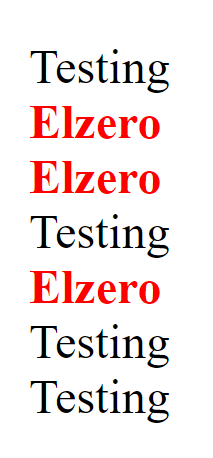 </div>

---

## Media Queries

### Assignment 1

```css
@media print {
  .assign-one {
    font-size: 40px;
  }
}
```

---

### Assignment 2

```html
<div class="grid">
  <div class="card">
    <div class="name">Product One</div>
    <div class="desc">This Is Product</div>
  </div>
  <div class="card">
    <div class="name">Product Two</div>
    <div class="desc">This Is Product</div>
  </div>
  <div class="card">
    <div class="name">Product Three</div>
    <div class="desc">This Is Product</div>
  </div>
  <div class="card">
    <div class="name">Product Four</div>
    <div class="desc">This Is Product</div>
  </div>
</div>
```

```css
.grid {
  display: grid;
  gap: 10px;
  grid-template-columns: repeat(4, 1fr);
}

.card {
  background: #f5f5f5;
  border: 1px solid #e0e0e0;
  border-radius: 6px;
  padding: 16px;
  text-align: center;
}

.card .name {
  font-size: 14px;
  font-weight: bold;
  color: #1D9E75;
}

.card .desc {
  font-size: 12px;
  color: #777;
  margin-top: 4px;
}

@media (max-width: 900px) {
  .grid {
    grid-template-columns: repeat(2, 1fr);
  }

  .card .name {
    color: #D85A30;
  }
}

@media (max-width: 480px) {
  .grid {
    grid-template-columns: 1fr;
  }

  .card .name {
    color: #333;
  }
}
```

<div style="display:flex; justify-content:center; align-items:center; gap:16px; flex-wrap:wrap;"> 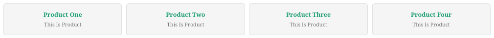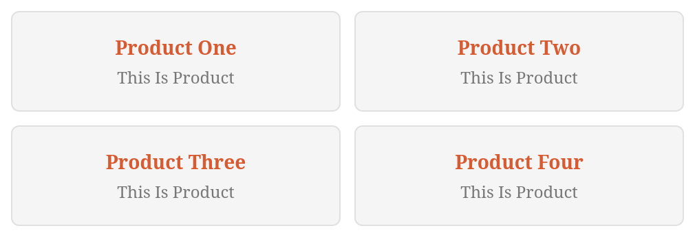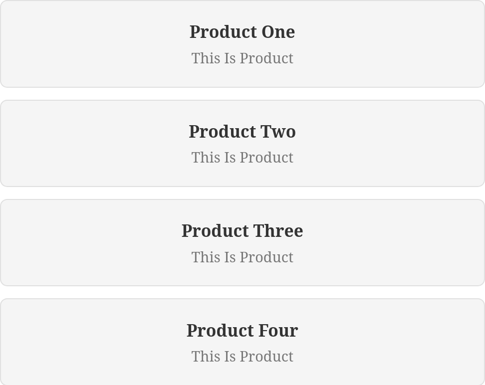 </div>

---

### Assignment 3

```css
.grid {
  display: grid;
  gap: 10px;
  grid-template-columns: 1fr 2fr 2fr 1fr;
  grid-template-areas:
    "one  one   one   one"
    "two  two   three three"
    "four four  four  four";
}

.card {
  background: #f5f5f5;
  border: 1px solid #e0e0e0;
  border-radius: 6px;
  padding: 16px;
  text-align: center;
}

.card .name {
  font-size: 14px;
  font-weight: bold;
  color: #1D9E75;
}

.card .desc {
  font-size: 12px;
  color: #777;
  margin-top: 4px;
}

.card-one   { grid-area: one; }
.card-two   { grid-area: two; }
.card-three { grid-area: three; }
.card-four  { grid-area: four; }

@media (max-width: 900px) {
  .grid {
    grid-template-columns: repeat(3, 1fr);
    grid-template-areas:
      "one   one   one"
      "two   three four";
  }

  .card .name {
    color: #ff0202;
  }
}

@media (max-width: 480px) {
  .grid {
    grid-template-columns: 1fr;
    grid-template-areas:
      "one"
      "two"
      "three"
      "four";
  }

  .card .name {
    color: black;
  }
}
```

<div style="display:flex; justify-content:center; align-items:center; gap:16px; flex-wrap:wrap;"> 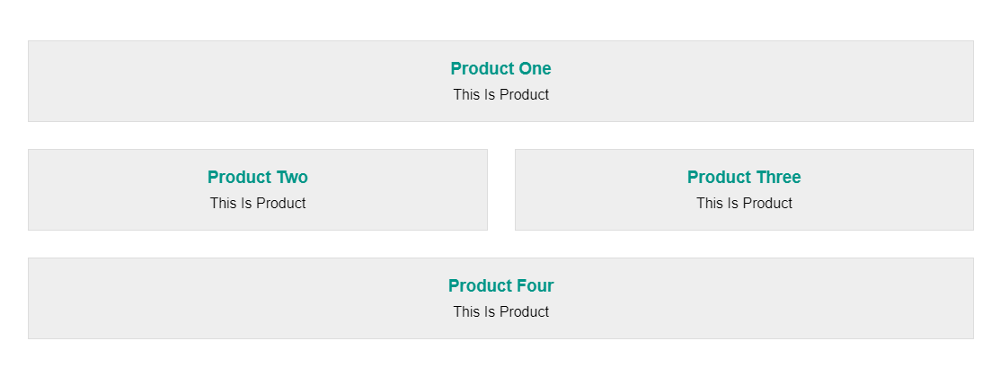  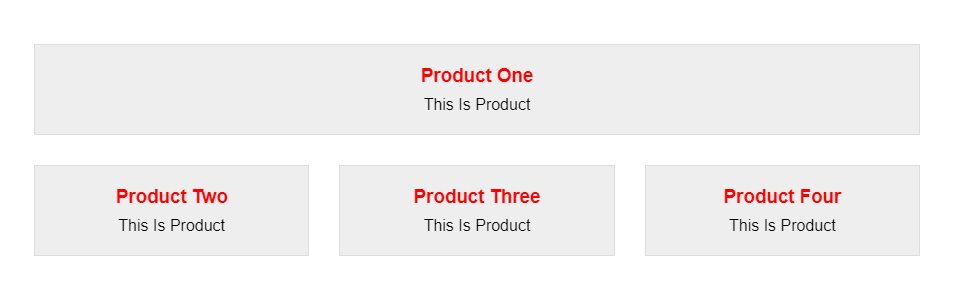 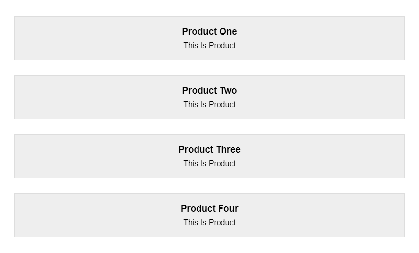</div>

---

## Global Values

### Assignment 1

```css
.center-flex {
  display: flex;
  align-items: center;
  justify-content: center;
}

.center-position {
  align-self: center;
  justify-self: center;
}

.circle-100 {
  width: 100px;
  height: 100px;
  border-radius: 50%;
}

.circle-200 {
  width: 200px;
  height: 200px;
  border-radius: 50%;
}
```

---

### Assignment 2

```css
.arrow {
  position: relative;
  display: inherit;
  background-color: #dddddd;
  color: initial;
  padding: 10px 20px;
  border-radius: 4px;
  margin: 20px;
}

.arrow::after {
  content: "";
  position: absolute;
  border: 8px solid transparent;
}

.arrow.top::after {
  bottom: 100%;
  left: 50%;
  transform: translateX(-50%);
  border-bottom-color: #dddddd;
}

.arrow.right::after {
  top: 50%;
  left: 100%;
  transform: translateY(-50%);
  border-left-color: #dddddd;
}

.arrow.bottom::after {
  top: 100%;
  left: 50%;
  transform: translateX(-50%);
  border-top-color: #dddddd;
}

.arrow.left::after {
  top: 50%;
  right: 100%;
  transform: translateY(-50%);
  border-right-color: #dddddd;
}
```

<div style="display:flex; justify-content:center; align-items:center; gap:16px; flex-wrap:wrap;"> 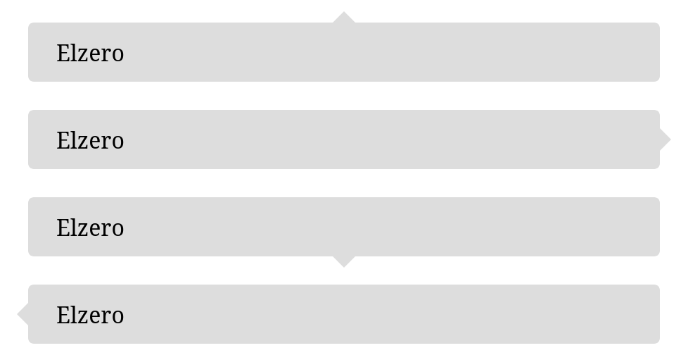 </div>