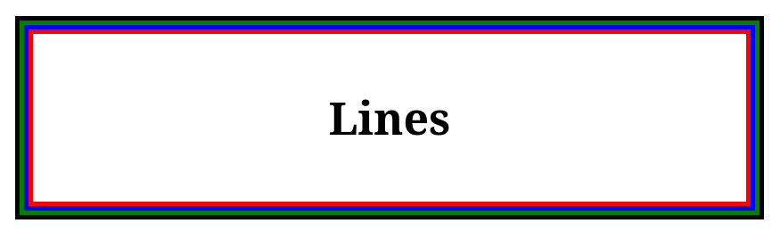

## Assignment no. 1
```html
<div class="elzero-lines">Lines</div>
```

```css
body {
    height: 100vh;
    width: 100vw;
    display: flex;
    align-items: center;
    justify-content: center;
}

.elzero-lines {
    --line: 5px;

    position: relative;
    width: 800px;
    padding: 60px 0;
    text-align: center;
    font-size: 50px;
    font-weight: bold;
    background: #fff;

    border: var(--line) solid red;
}

.elzero-lines::before,
.elzero-lines::after {
    content: "";
    position: absolute;
    inset: calc(var(--line) * -2);
    pointer-events: none;
}

.elzero-lines::before {
    border: var(--line) solid blue;
}

.elzero-lines::after {
    inset: calc(var(--line) * -3);
    border: var(--line) solid green;
    outline: var(--line) solid black;
}
```

<div style="display:flex; justify-content:center; align-items:center; gap:16px; flex-wrap:wrap;">
  
</div>

---

## Assignment no. 2
```html
    <link rel="stylesheet" href="helper.css">
    <link rel="stylesheet" href="css/main.css">
    <link rel="stylesheet" href="css/fonts.css">
    <link rel="stylesheet" href="libs/kit.css">
    <link rel="stylesheet" href="libs/ui.css">
    <link rel="stylesheet" href="libs/custom/custom.css">

```

---

## Assignment no. 3
```html
<p class="font">Elzero</p>
```

```css
/* font: font-style font-variant font-weight font-size/line-height font-family; */
font: italic bold 30px/30px Arial, sans-serif;
```

<div style="display:flex; justify-content:center; align-items:center; gap:16px; flex-wrap:wrap;">
  
</div>

---

## Assignment no. 4
```html
<div class="input-box">
  <span class="prefix">+20</span>
  <input type="tel" placeholder="1011001100" />
</div>
```

```css
body {
    height: 100vh;
    width: 100vw;
    display: flex;
    align-items: center;
    justify-content: center;
}

.input-box {
    display: flex;
    /* align-items: stretch; */
    width: 300px;
    height: 30px;
    border: 1px solid #aaa;
    border-radius: 4px;
    overflow: hidden;
    font-family: Arial, Helvetica, sans-serif;
}

.prefix {
    display: flex;
    align-items: center;
    justify-content: center;
    background-color: #14a085;
    color: white;
    font-size: 16px;
    font-weight: bold;
    padding: 10px 5px;
}

.input-box input {
    flex: 1;
    border: none;
    outline: none;
    padding: 0 5px;
    font-size: 12px;
    color: #333;
    caret-color: #14a085;
}

.input-box input::placeholder {
    color: #aaa;
}
```

<div style="display:flex; justify-content:center; align-items:center; gap:16px; flex-wrap:wrap;">
  
</div>

---

## Assignment no. 5
```html
<div class="menu">
  <span></span>
  <span></span>
  <span></span>
</div>
```

```css
body {
    height: 100vh;
    width: 100vw;
    display: flex;
    align-items: center;
    justify-content: center;
}

.menu {
    width: 300px;
    height: 200px;
    display: flex;
    flex-direction: column;
    justify-content: center;
    align-items: center;
    gap: 25px;
    cursor: pointer;
    margin: 50px auto;
}

.menu span {
    width: 200px;
    height: 40px;
    background-color: black;
    border-radius: 20px;
    transition: all 0.35s ease;
}

.menu:hover{
    gap: 0;
}

.menu:hover span {
    background-color: red;
    position: absolute;
}

.menu:hover span:nth-child(1) {
    transform: rotate(135deg);
}

.menu:hover span:nth-child(2) {
    transform: translateX(-200px);
    opacity: 0;
}

.menu:hover span:nth-child(3) {
    transform: rotate(-135deg);
}

```

<div style="display:flex; justify-content:center; align-items:center; gap:16px; flex-wrap:wrap;">
  
  
</div>

---

## Assignment no. 6
```html

```

```css

```

---

## Assignment no. 7
```html

```

```css

```

---

## Assignment no. 8
```html

```

```css

```

---

## Assignment no. 9
```html

```

```css

```

---

## Assignment no. 10
```html

```

```css

```

---

## Assignment no. 11
```html

```

```css

```

## Assignment no. 12
```html

```

```css

```

## Assignment no. 13
```html

```

```css

```

## Assignment no. 14
```html

```

```css

```

## Assignment no. 15
```html

```

```css

```

## Assignment no. 16
```html

```

```css

```

## Assignment no. 17
```html

```

```css

```

## Assignment no. 18
```html

```

```css

```

## Assignment no. 19
```html

```

```css

```

## Assignment no. 20
```html

```

```css

```

## Assignment no. 21
```html

```

```css

```

## Assignment no. 22
```html

```

```css

```

## Assignment no. 23
```html

```

```css

```

## Assignment no. 24
```html

```

```css

```

## Assignment no. 25
```html

```

```css

```