## Assignment 1

```html
<div class="elzero-lines">Lines</div>
```

```css
body {
  height: 100vh;
  width: 100vw;
  display: flex;
  align-items: center;
  justify-content: center;
}

.elzero-lines {
  --line: 5px;
  position: relative;
  width: 800px;
  padding: 60px 0;
  text-align: center;
  font-size: 50px;
  font-weight: bold;
  background: #fff;
  border: var(--line) solid red;
}

.elzero-lines::before,
.elzero-lines::after {
  content: "";
  position: absolute;
  inset: calc(var(--line) * -2);
  pointer-events: none;
}

.elzero-lines::before {
  border: var(--line) solid blue;
}

.elzero-lines::after {
  inset: calc(var(--line) * -3);
  border: var(--line) solid green;
  outline: var(--line) solid black;
}
```

<div style="display:flex; justify-content:center; align-items:center; gap:16px; flex-wrap:wrap;">  </div>

---

## Assignment 2

```html
<link rel="stylesheet" href="helper.css">
<link rel="stylesheet" href="css/main.css">
<link rel="stylesheet" href="css/fonts.css">
<link rel="stylesheet" href="libs/kit.css">
<link rel="stylesheet" href="libs/ui.css">
<link rel="stylesheet" href="libs/custom/custom.css">
```

---

## Assignment 3

```html
<p class="font">Elzero</p>
```

```css
/* font: font-style font-variant font-weight font-size/line-height font-family; */
.font {
  font: italic bold 30px/30px Arial, sans-serif;
}
```

<div style="display:flex; justify-content:center; align-items:center; gap:16px; flex-wrap:wrap;">  </div>

---

## Assignment 4

```html
<div class="input-box">
  <span class="prefix">+20</span>
  <input type="tel" placeholder="1011001100" />
</div>
```

```css
body {
  height: 100vh;
  width: 100vw;
  display: flex;
  align-items: center;
  justify-content: center;
}

.input-box {
  display: flex;
  /* align-items: stretch; */
  width: 300px;
  height: 30px;
  border: 1px solid #aaa;
  border-radius: 4px;
  overflow: hidden;
  font-family: Arial, Helvetica, sans-serif;
}

.prefix {
  display: flex;
  align-items: center;
  justify-content: center;
  background-color: #14a085;
  color: white;
  font-size: 16px;
  font-weight: bold;
  padding: 10px 5px;
}

.input-box input {
  flex: 1;
  border: none;
  outline: none;
  padding: 0 5px;
  font-size: 12px;
  color: #333;
  caret-color: #14a085;
}

.input-box input::placeholder {
  color: #aaa;
}
```

<div style="display:flex; justify-content:center; align-items:center; gap:16px; flex-wrap:wrap;"> 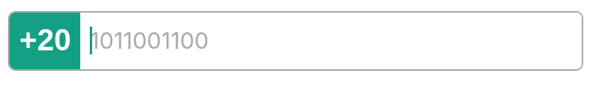 </div>

---

## Assignment 5

```html
<div class="menu">
  <span></span>
  <span></span>
  <span></span>
</div>
```

```css
body {
  height: 100vh;
  width: 100vw;
  display: flex;
  align-items: center;
  justify-content: center;
}

.menu {
  width: 300px;
  height: 200px;
  display: flex;
  flex-direction: column;
  justify-content: center;
  align-items: center;
  gap: 25px;
  cursor: pointer;
  margin: 50px auto;
}

.menu span {
  width: 200px;
  height: 40px;
  background-color: black;
  border-radius: 20px;
  transition: all 0.35s ease;
}

.menu:hover {
  gap: 0;
}

.menu:hover span {
  background-color: red;
  position: absolute;
}

.menu:hover span:nth-child(1) {
  transform: rotate(135deg);
}

.menu:hover span:nth-child(2) {
  transform: translateX(-200px);
  opacity: 0;
}

.menu:hover span:nth-child(3) {
  transform: rotate(-135deg);
}
```

<div style="display:flex; justify-content:center; align-items:center; gap:16px; flex-wrap:wrap;"> 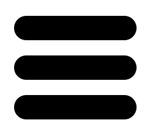  </div>

---

## Assignment 6

```html
<a class="url" href="https://google.com">Google</a>
<a class="link" href="https://elzero.org/">Elzero Academy</a>
<a href="https://www.elzero.courses/">Elzero Courses</a>
```

```css
a {
  color: black;
  border-radius: 5px;
  text-decoration: none;
  font-weight: bold;
}

a:not([class]) {
  color: #e8452e;
}
```

<div style="display:flex; justify-content:center; align-items:center; gap:16px; flex-wrap:wrap;">  </div>

---

## Assignment 7

```html
<ul>
  <li>List item</li>
  <li>List item</li>
  <li>List item</li>
  <li>
    List item
    <ul>
      <li>Sub List item</li>
      <li>Sub List item</li>
      <li>Sub List item</li>
    </ul>
  </li>
</ul>
```

```css
body {
    margin: 0;
    min-height: 100vh;
    background: #eee;
    display: flex;
    justify-content: center;
    padding: 40px 0;
    font-family: Arial, Helvetica, sans-serif;
}


ul {
    list-style: none;
    margin: 0;
    padding: 0;
    width: 800px;
}

ul {
    counter-reset: item;
}

ul>li {
    counter-increment: item;
    background-color: #fff;
    margin-bottom: 10px;
    padding: 10px;
    display: flex;
    flex-direction: row;
    align-items: center;
    border-radius: 4px;
}

ul>li::before {
    content: counter(item);
    flex-shrink: 0;
    width: 50px;
    height: 50px;
    background-color: #ddd;
    color: #000;
    font-weight: bold;
    font-size: 24px;
    display: flex;
    align-items: center;
    justify-content: center;
    margin-right: 20px;
    border-radius: 4px;
}

ul>li:has(> ul) {
    flex-wrap: wrap;
    align-content: flex-start;
    background: #ddd;
}

ul>li:has(> ul)::before {
    background-color: #fff;
    margin-right: 30px;
}

ul>li>ul {
    counter-reset: subitem;
    width: 100%;
    margin-top: 10px;
    /* flex-basis: 100%; */
}

ul>li>ul>li {
    counter-increment: subitem;
    background-color: #fff;
    width: 90%;
    margin: 10px auto;
    padding: 10px;
    display: flex;
    flex-direction: row;
    align-items: center;
    border-radius: 4px;
}

ul>li>ul>li::before {
    content: counter(item) "." counter(subitem);
    flex-shrink: 0;
    min-width: 50px;
    height: 50px;
    background: #009688;
    color: #fff;
    font-weight: bold;
    font-size: 24px;
    display: flex;
    align-items: center;
    justify-content: center;
    margin-right: 20px;
    border-radius: 4px;
}
```

<div style="display:flex; justify-content:center; align-items:center; gap:16px; flex-wrap:wrap;"> 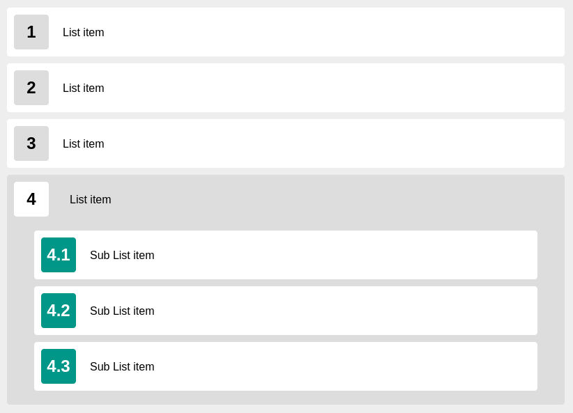 </div>

---

## Assignment 8

```html
<a class="url" href="https://google.com" title="Google"></a>
<a class="link" href="https://elzero.org/" title="Elzero Academy"></a>
<a href="https://www.elzero.courses/" title="Elzero Courses"></a>
```

```css
a {
  display: block;
  width: 700px;
  margin: 0 auto 50px;
  color: white;
  text-decoration: none;
  font-weight: bold;
  font-size: 20px;
  border-radius: 10px;
}

a::before {
  content: "Name: " attr(title) " | URL: " attr(href);
  background-color: #2196f3;
  padding: 20px 25px;
  border-radius: 10px;
}
```

<div style="display:flex; justify-content:center; align-items:center; gap:16px; flex-wrap:wrap;">  </div>

---

## Assignment 9

```html
<div class="text">elzero web school</div>
```

```css
.text {
    font-size: 100px;
    font-weight: bold;
    font-family: Arial, Helvetica, sans-serif;
    text-transform: capitalize;

    background: linear-gradient(to bottom,
            #ff3d00 0%,
            #ff5a00 35%,
            #d89200 100%);
    background-clip: text;
    color: transparent;
}
```

<div style="display:flex; justify-content:center; align-items:center; gap:16px; flex-wrap:wrap;">  </div>

---

## Assignment 10

```html
<div class="container">
  <div class="white"></div>
  <div class="black"></div>
  <div class="white"></div>
  <div class="black"></div>
  <div class="white"></div>
  <div class="black"></div>
  <div class="white"></div>
  <div class="black"></div>
  <div class="black"></div>
  <div class="white"></div>
  <div class="black"></div>
  <div class="white"></div>
  <div class="black"></div>
  <div class="white"></div>
  <div class="black"></div>
  <div class="white"></div>
  <div class="white"></div>
  <div class="black"></div>
  <div class="white"></div>
  <div class="black"></div>
  <div class="white"></div>
  <div class="black"></div>
  <div class="white"></div>
  <div class="black"></div>
  <div class="black"></div>
  <div class="white"></div>
  <div class="black"></div>
  <div class="white"></div>
  <div class="black"></div>
  <div class="white"></div>
  <div class="black"></div>
  <div class="white"></div>
  <div class="white"></div>
  <div class="black"></div>
  <div class="white"></div>
  <div class="black"></div>
  <div class="white"></div>
  <div class="black"></div>
  <div class="white"></div>
  <div class="black"></div>
  <div class="black"></div>
  <div class="white"></div>
  <div class="black"></div>
  <div class="white"></div>
  <div class="black"></div>
  <div class="white"></div>
  <div class="black"></div>
  <div class="white"></div>
  <div class="white"></div>
  <div class="black"></div>
  <div class="white"></div>
  <div class="black"></div>
  <div class="white"></div>
  <div class="black"></div>
  <div class="white"></div>
  <div class="black"></div>
  <div class="black"></div>
  <div class="white"></div>
  <div class="black"></div>
  <div class="white"></div>
  <div class="black"></div>
  <div class="white"></div>
  <div class="black"></div>
  <div class="white"></div>
</div>
```

```css
body {
  margin: 0;
  min-height: 100vh;
  display: flex;
  justify-content: center;
  align-items: center;
  background: #ddd;
}

.container {
  width: 400px;
  height: 400px;
  display: grid;
  grid-template-columns: repeat(8, 1fr);
  grid-template-rows: repeat(8, 1fr);
  border: 4px solid #000;
}

.white {
  background-color: #fff;
}

.black {
  background-color: #000;
}
```

<div style="display:flex; justify-content:center; align-items:center; gap:16px; flex-wrap:wrap;"> 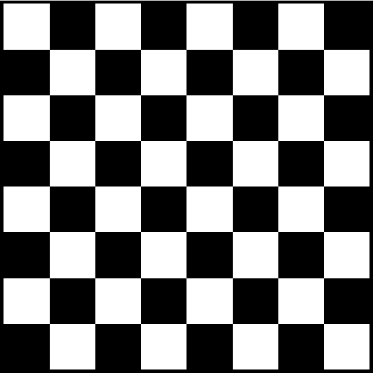 </div>

---

## Assignment 11

```html
<table>
  <tr>
    <th>Language</th>
    <th>Created By</th>
    <th>Created Year</th>
  </tr>
  <tr>
    <td>Python</td>
    <td>Guido van Rossum</td>
    <td>1991</td>
  </tr>
  <tr>
    <td>Java</td>
    <td>James Gosling</td>
    <td>1995</td>
  </tr>
  <tr>
    <td>JavaScript</td>
    <td>Brendan Eich</td>
    <td>1995</td>
  </tr>
  <tr>
    <td>PHP</td>
    <td>Rasmus Lerdorf</td>
    <td>1995</td>
  </tr>
  <tr>
    <td>Swift</td>
    <td>Chris Lattner</td>
    <td>2014</td>
  </tr>
</table>
```

```css
table {
    width: 100%;
    max-width: 700px;
    margin: 0 auto;
}

th,
td {
    border: 1px solid #ddd;
    padding: 18px;
    text-align: center;
    background-color: white;
}

th {
    font-weight: bold;
}

tr:hover td {
    background-color: #f7f7f7;
}

table:has(tr td:nth-child(1):hover) tr td:nth-child(1),
table:has(tr td:nth-child(2):hover) tr td:nth-child(2),
table:has(tr td:nth-child(3):hover) tr td:nth-child(3) {
    background-color: #f7f7f7;
}

td:hover {
    border: 1px solid #2196f3;
    color: #2196f3;
}
```

<div style="display:flex; justify-content:center; align-items:center; gap:16px; flex-wrap:wrap;"> 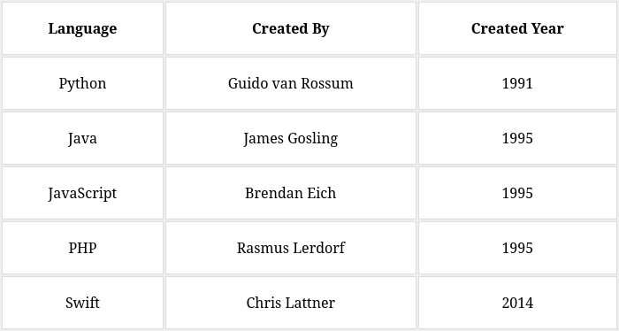
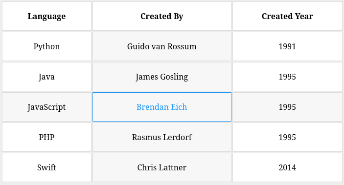
</div>

---

## Assignment 12

```html
<div class="plans">
  <div class="plan">
    <h2>Personal</h2>

    <div class="price">
      <span class="currency">$</span>
      <span class="number">10</span>
      <span class="time">/ Mo</span>
    </div>

    <ul>
      <li><strong>Free</strong> Weekly Meeting</li>
      <li><strong>1x</strong> Monthly Call</li>
      <li><strong>Unlimited</strong> Messenger Chats</li>
      <li><strong>Free</strong> Control Panel Access</li>
      <li><strong>1x</strong> Face to Face Meeting</li>
    </ul>

    <button>Buy Now</button>
  </div>

  <div class="plan popular">
    <span class="label">Most Popular</span>

    <h2>Business</h2>

    <div class="price">
      <span class="currency">$</span>
      <span class="number">15</span>
      <span class="time">/ Mo</span>
    </div>

    <ul>
      <li><strong>Free</strong> Weekly Meeting</li>
      <li><strong>2x</strong> Monthly Call</li>
      <li><strong>Unlimited</strong> Messenger Chats</li>
      <li><strong>Free</strong> Control Panel Access</li>
      <li><strong>2x</strong> Face to Face Meeting</li>
    </ul>

    <button>Buy Now</button>
  </div>

  <div class="plan">
    <h2>Enterprise</h2>

    <div class="price">
      <span class="currency">$</span>
      <span class="number">20</span>
      <span class="time">/ Mo</span>
    </div>

    <ul>
      <li><strong>Free</strong> Daily Meeting</li>
      <li><strong>3x</strong> Monthly Call</li>
      <li><strong>Unlimited</strong> Messenger Chats</li>
      <li><strong>Free</strong> Control Panel Access</li>
      <li><strong>3x</strong> Face to Face Meeting</li>
    </ul>

    <button>Buy Now</button>
  </div>
</div>
```

```css
* {
    box-sizing: border-box;
    margin: 0;
    padding: 0;
}

body {
    width: 100vw;
    height: 100vh;
    font-family: Arial, sans-serif;
    background: #eee;
    display: flex;
    align-items: center;
    justify-content: center;
}

.plans {
    margin: 40px auto;
    display: flex;
    gap: 40px;
}


.plan {
    flex: 1;
    background: white;
    border: 1px solid #ddd;
    padding: 50px 60px;
    text-align: center;
    position: relative;
}

.plan h2 {
    font-size: 30px;
    margin: -20px 0px 20px;
}

.price {
    margin-bottom: 40px;
}


.currency {
    color: #1976f2;
    font-size: 20px;
    vertical-align: top;
}

.number {
    color: #1976f2;
    font-size: 50px;
    font-weight: bold;
}

.time {
    color: #777;
    font-size: 20px;
}

ul {
    list-style: none;
}

li {
    color: #777;
    margin: 22px 0;
}

button {
    margin-top: 35px;
    border: none;
    border-radius: 30px;
    padding: 20px 25px;
    background: #1976f2;
    color: white;
    font-weight: bold;
    cursor: pointer;
}

.label {
    position: absolute;
    top: -20px;
    left: 50%;
    transform: translateX(-50%);
    width: 250px;
    padding: 10px 0;
    background: #1976f2;
    color: white;
    font-weight: bold;
    text-align: center;
}

.label::before,
.label::after {
    content: "";
    position: absolute;
    top: 0px;
    border-style: solid;
}

.label::before {
    left: -20px;
    border-width: 10px;
    border-color: transparent #0e56b5 #0e56b5 transparent;
}

.label::after {
    right: -20px;
    border-width: 10px;
    border-color: transparent transparent #0e56b5 #0e56b5;
}
```

<div style="display:flex; justify-content:center; align-items:center; gap:16px; flex-wrap:wrap;">  </div>

---

## Assignment 13

```html
<div class="cards">
  <div class="card active">
    <span class="dot"></span>

    <h3>Standard</h3>

    <div class="storage">
      <span class="big">1</span>
      <span class="tb">TB</span>
      <span class="gb">(1000gb)</span>
    </div>

    <p><strong>$40</strong>/month</p>
  </div>


  <div class="card">
    <span class="dot"></span>

    <h3>Pro</h3>

    <div class="storage">
      <span class="big">2</span>
      <span class="tb">TB</span>
      <span class="gb">(2000gb)</span>
    </div>

    <p><strong>$70</strong>/month</p>
  </div>

  <div class="card">
    <span class="dot"></span>

    <h3>Ultimate</h3>

    <div class="storage">
      <span class="big">5</span>
      <span class="tb">TB</span>
      <span class="gb">(5000gb)</span>
    </div>

    <p><strong>$100</strong>/month</p>
  </div>
</div>
```

```css
* {
    box-sizing: border-box;
}

body {
    background-color: #eee;
    font-family: Arial, Helvetica, sans-serif;
    padding: 30px;
}

.cards {
    width: 90vw;
    margin: 40px auto;
    display: flex;
    gap: 30px;
}

.card {
    flex: 1;
    background: white;
    border-radius: 14px;
    padding: 10px 28px;
    position: relative;
    transition: all .3s ease;
    box-shadow: 0 4px 15px rgba(0, 0, 0, .15);
}

.card.active {
    border: 2px solid #2f6df6;
}

.dot {
    position: absolute;
    right: 28px;
    top: 30px;
    width: 20px;
    height: 20px;
    border-radius: 50%;
    background-color: #a19f9f;
    box-shadow: 0 4px 15px rgba(0, 0, 0, .45);
}

.card.active .dot {
    background-color: #2f6df6;
}

h3 {
    color: #555;
    font-weight: bold;
    margin-bottom: 10px;
}

.big {
    font-size: 60px;
    font-weight: bold;
    color: #555;
}

.tb {
    font-size: 30px;
    color: #555;
    font-weight: bold;
    margin-right: 5px;
}

.gb {
    color: #777;
    font-size: 20px;
}

p {
    margin-top: 15px;
    color: #777;
    font-size: 18px;
}

p strong {
    color: #555;
    font-size: 24px;
}
```

<div style="display:flex; justify-content:center; align-items:center; gap:16px; flex-wrap:wrap;"> 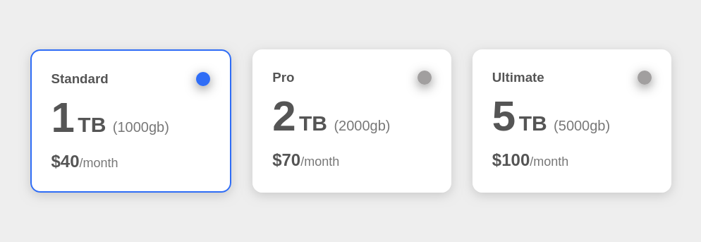 </div>

---

## Assignment 14

```html
<!DOCTYPE html>
<html lang="en">

<head>
    <meta charset="UTF-8">
    <meta name="viewport" content="width=device-width, initial-scale=1.0">
    <title>Document</title>
    <link rel="stylesheet" href="css/main.css">
</head>

<body>
    <div style="display: flex; align-items: center; justify-content: center; width: fit-content; height:fit-content;">
        <div class="camera">
            <div class="btn"></div>
            <div class="bump">
                <div class="bump-window"></div>
            </div>
            <div class="body">
                <div class="lens">
                    <div class="lens-ring">
                        <div class="lens-glass"></div>
                    </div>
                </div>
            </div>
        </div>
    </div>
    <script src="main.js"></script>
</body>

</html>
```

```css
* {
    box-sizing: border-box;
    margin: 0;
    padding: 0;
}

body {
    min-height: 100vh;
    background: #eee;
    display: flex;
    align-items: center;
    justify-content: center;
}

.camera {
    position: relative;
    width: 600px;
    height: 400px;
}

.body {
    position: absolute;
    inset: 0;
    background-color: #cccccc;
    border-radius: 18px;
    overflow: hidden;
}

.body::before {
    content: "";
    position: absolute;
    top: 50%;
    transform: translateY(-50%);
    left: 0;
    width: 100%;
    height: 50%;
    background: #607c8a;
}

.bump {
    position: relative;
    width: 100px;
    height: 65px;
    top: -55px;
    left: 50%;
    transform: translateX(-50%);
    background-color: #607c8a;
}

.bump::after,
.bump::before {
    content: "";
    position: absolute;
    top: 0px;
    background-color: #607c8a;
    border-radius: 10px 10px 0 0;
    z-index: -1;
}

.bump::before {
    left: 50%;
    width: 80px;
    height: 65px;
    transform: skewX(30deg);
}


.bump::after {
    right: 50%;
    width: 80px;
    height: 65px;
    transform: skewX(-30deg);
}

.bump-window {
    position: absolute;
    top: 18px;
    left: 50%;
    transform: translateX(-50%);
    width: 100px;
    height: 26px;
    background: #cfd1d0;
    border-radius: 10px;
}

.bump-window::after {
    content: "";
    position: absolute;
    top: 50%;
    left: 50%;
    transform: translate(-50%, -50%);
    width: 40px;
    height: 13px;
    background: #607c8a;
    border-radius: 3px;
}

.btn {
    position: absolute;
    top: -15px;
    left: 30px;
    width: 80px;
    height: 16px;
    background: #607c8a;
    border-radius: 15px 15px 6px 6px;
    z-index: 1;
}

.btn::before {
    content: "";
    position: absolute;
    top: -5px;
    left: 50%;
    transform: translateX(-50%);
    width: 60px;
    height: 5px;
    background: #d81159;
    border-radius: 20px 20px 6px 6px;
}

.lens {
    position: absolute;
    top: 50%;
    left: 50%;
    transform: translate(-50%, -50%);
    width: 280px;
    height: 280px;
    background: #f4f4f4;
    border-radius: 50%;
    display: flex;
    align-items: center;
    justify-content: center;
    box-shadow: 0px 0px 19px rgba(0, 0, 0, 0.697);
}

.lens-ring {
    width: 210px;
    height: 210px;
    background: #3a3c3d;
    border-radius: 50%;
    display: flex;
    align-items: center;
    justify-content: center;
}


.lens-ring::before {
    content: "";
    position: absolute;
    width: 250px;
    height: 250px;
    background: #cecece;
    border-radius: 50%;
    display: flex;
    align-items: center;
    justify-content: center;
    z-index: -1;
}

.lens-glass {
    position: relative;
    width: 150px;
    height: 150px;
    background: radial-gradient(circle at 40% 35%, #5da9cf, #2f7fa8 70%);
    border-radius: 50%;
}

.lens-glass::after {
    content: "";
    position: absolute;
    top: 22px;
    left: 26px;
    width: 30px;
    height: 30px;
    background: #7fc3e0;
    border-radius: 50%;
    opacity: 0.85;
}
```

<div style="display:flex; justify-content:center; align-items:center; gap:16px; flex-wrap:wrap;">  </div>

---

## Assignment 15

```html
<h2>Elzero Web School</h2>
```

```css
body {
    margin: 0;
    font-family: Arial, Helvetica, sans-serif;
    min-height: 100vh;
    background-color: #eee;
    display: flex;
    align-items: center;
    justify-content: center;
}

h2 {
    font-family: Arial, Helvetica, sans-serif;
    font-weight: bold;
    font-size: 90px;
    color: transparent;
    -webkit-text-stroke: 4px #9c27b0;
    letter-spacing: 2px;
}
```

<div style="display:flex; justify-content:center; align-items:center; gap:16px; flex-wrap:wrap;">  </div>

---

## Assignment 16

```css
* {
  box-sizing: border-box;
  font-family: Arial, sans-serif;
}

body {
  background-color: #eeeeee;
  padding: 30px;
}

table {
  width: 100%;
  margin: 0 auto;
  border-collapse: collapse;
}

caption {
  caption-side: bottom;
  background-color: #ccc;
  font-weight: bold;
  font-size: 18px;
  padding: 18px;
}

thead th {
  background-color: #ccc;
  font-size: 16px;
  padding: 16px;
  text-align: center;
  border-right: 2px solid #eee;
}

tbody td {
  background-color: #fff;
  padding: 14px;
  text-align: center;
  border-bottom: 2px solid #eee;
  border-right: 2px solid #eee;
}

tfoot td {
  padding: 15px;
  text-align: center;
  font-weight: bold;
  font-size: 16px;
  border: 2px solid #eee;
}

tfoot td:first-child {
  background-color: #ffe600;
  color: #222;
}

tfoot td:not(:first-child) {
  background-color: #00a2ff;
  color: white;
}
```

<div style="display:flex; justify-content:center; align-items:center; gap:16px; flex-wrap:wrap;"> 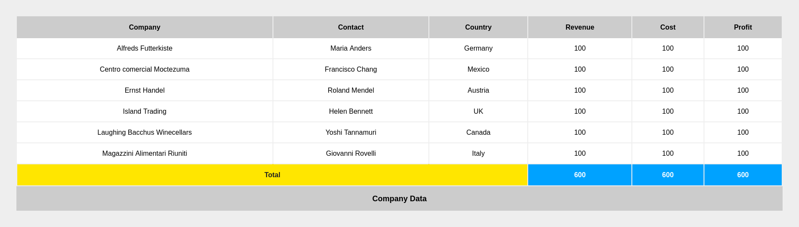 </div>

---

## Assignment 17

```html
<div>
  Hello, Iam Osama Elzero From Elzero Web School. Iam In Love With Programming Specially C++, Python, JS, And Many
  More Languages Lorem ipsum dolor sit amet consectetur adipisicing elit. Officiis, maxime recusandae! Eveniet, quas
  eius amet nostrum enim sint quis, ab perferendis voluptatibus culpa doloremque nulla harum aliquid illum?
  Perspiciatis, veniam.
</div>
```

```css
div {
  margin: 0 auto;
  background-color: white;
  padding: 30px;
  color: #1c3faa;
  font-size: 16px;
  line-height: 2.2;
  column-count: 3;
  column-gap: 40px;
  column-rule: 2px dashed #333;
}
```

<div style="display:flex; justify-content:center; align-items:center; gap:16px; flex-wrap:wrap;"> 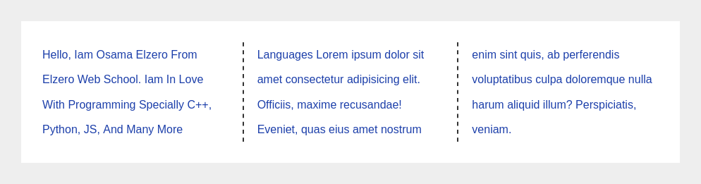 </div>

---

## Assignment 18

```html
<ul>
  <li>Python</li>
  <li>PHP</li>
  <li>JavaScript</li>
  <li>C++</li>
  <li>C#</li>
  <li>Java</li>
</ul>
```

```css
* {
  box-sizing: border-box;
  font-family: Arial, sans-serif;
}

body {
  background-color: #eeeeee;
  padding: 30px;
}

ul {
  list-style: none;
  max-width: 650px;
  margin: 0 auto;
  background-color: white;
  padding: 0;
  counter-reset: langCounter 10;
}

ul li {
  position: relative;
  padding: 30px 90px 30px 30px;
  font-size: 20px;
  color: #222;
  border-bottom: 1px solid #eee;
  counter-increment: langCounter 3;
}

ul li:last-child {
  border-bottom: none;
}

ul li::before {
  content: "(" counter(langCounter) ")";
  position: absolute;
  top: 50%;
  left: 85%;
  transform: translateY(-50%);
  width: 60px;
  height: 60px;
  border-radius: 50%;
  display: flex;
  align-items: center;
  justify-content: center;
  color: white;
  font-weight: bold;
  font-size: 18px;
}

ul li:nth-child(odd)::before {
  background-color: #8e24aa;
}

ul li:nth-child(even)::before {
  background-color: #e8452e;
}
```

<div style="display:flex; justify-content:center; align-items:center; gap:16px; flex-wrap:wrap;"> 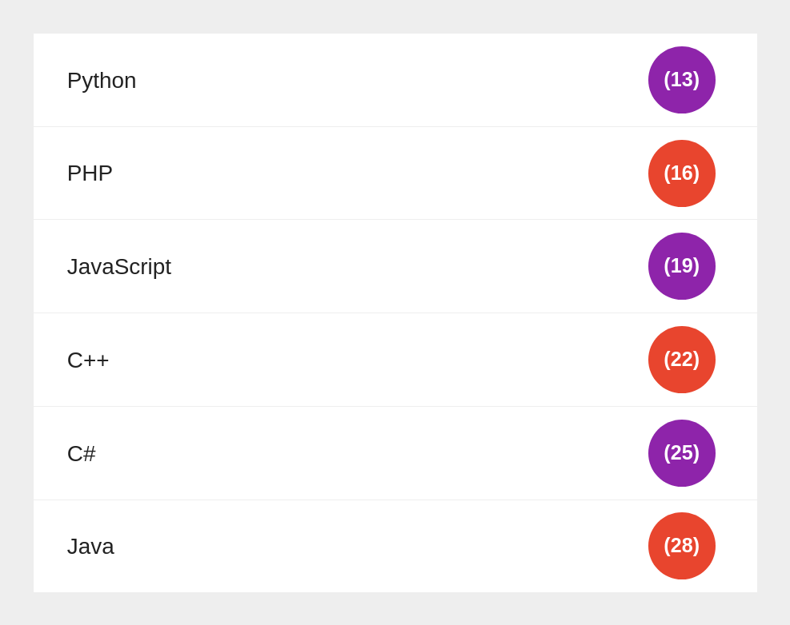 </div>

---

## Assignment 19

```html
<div>Elzero</div>
```

```css
div {
  --w: 10px;
  width: 500px;
  height: 100px;
  margin: calc(var(--w) * 9) auto;
  display: flex;
  align-items: center;
  justify-content: center;
  background-color: #eee;
  font-weight: bold;
  font-size: 20px;
  font-family: Arial, Helvetica, sans-serif;
  box-shadow:
    0 0 0 calc(var(--w) * 1) #cddc39,
    0 0 0 calc(var(--w) * 2) #e91e63,
    0 0 0 calc(var(--w) * 3) #9c27b0,
    0 0 0 calc(var(--w) * 4) #4caf50,
    0 0 0 calc(var(--w) * 5) #2f51b5,
    0 0 0 calc(var(--w) * 6) #795548,
    0 0 0 calc(var(--w) * 7) #f9a825,
    0 0 0 calc(var(--w) * 8) #009688;
}
```

<div style="display:flex; justify-content:center; align-items:center; gap:16px; flex-wrap:wrap;"> 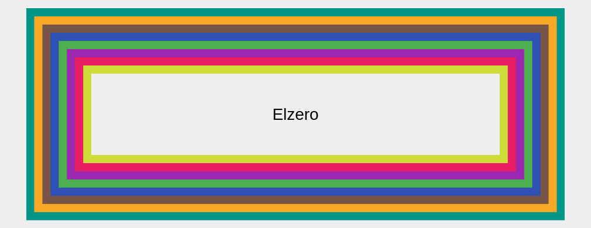 </div>

---

## Assignment 20

```html
<h1>Elzero</h1>
```

```css
body {
  height: 100vh;
  width: 100vw;
  display: flex;
  align-items: center;
  justify-content: center;
}

h1 {
  position: relative;
  background: #fff;
  padding: 20px 55px;
  border: 6px solid;
  border-color: transparent #f4442e #111;
  border-radius: 40px;
  font-weight: bold;
  font-size: 48px;
  color: #111;
  box-shadow: 0 25px 0 -12px #f4442e;
}

h1::before,
h1::after {
  content: "";
  position: absolute;
  top: 50%;
  width: 20px;
  height: 20px;
  background-color: #fff;
  border: 6px solid #f4442e;
  border-radius: 50%;
  transform: translateY(-50%);
}

h1::before {
  left: -32px;
}

h1::after {
  right: -32px;
}
```

<div style="display:flex; justify-content:center; align-items:center; gap:16px; flex-wrap:wrap;"> 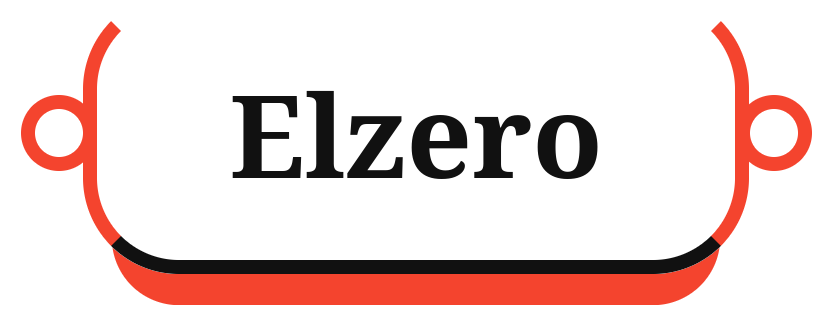 </div>

---

## Assignment 21

```css
.one {
  background: black url("../imgs/one.png") no-repeat left top / cover;
}

.two {
  border: 1px solid #000;
}

.three {
  inset: 10px 20px;
}

.four {
  flex: 3 3 10%;
}

.five {
  flex-flow: column wrap;
}
```

---

## Assignment 22

```html
<div class="gallery">
  <div class="item item-a"></div>
  <div class="item item-b"></div>
  <div class="item item-c"></div>
  <div class="item item-d"></div>
  <div class="item item-e"></div>
  <div class="item item-f"></div>
  <div class="item item-g"></div>
  <div class="item item-h"></div>
</div>
```

```css
* {
  box-sizing: border-box;
}

body {
  background-color: #eee;
  padding: 20px;
}

.gallery {
  display: grid;
  grid-template-columns: repeat(4, 1fr);
  grid-template-rows: repeat(3, 220px);
  gap: 18px;
  max-width: 1000px;
  margin: 0 auto;
  grid-template-areas:
    "a b c c"
    "a d e f"
    "g d h h";
}

.item {
  border-radius: 12px;
}

.item-a {
  grid-area: a;
  background-color: #2b1f4d;
}

.item-b {
  grid-area: b;
  background-color: #2196f3;
}

.item-c {
  grid-area: c;
  background-color: #d97706;
}

.item-d {
  grid-area: d;
  background-color: #1e293b;
}

.item-e {
  grid-area: e;
  background-color: #0891b2;
}

.item-f {
  grid-area: f;
  background-color: #16a34a;
}

.item-g {
  grid-area: g;
  background-color: #0ea5e9;
}

.item-h {
  grid-area: h;
  background-color: #0f172a;
}
```

<div style="display:flex; justify-content:center; align-items:center; gap:16px; flex-wrap:wrap;"> 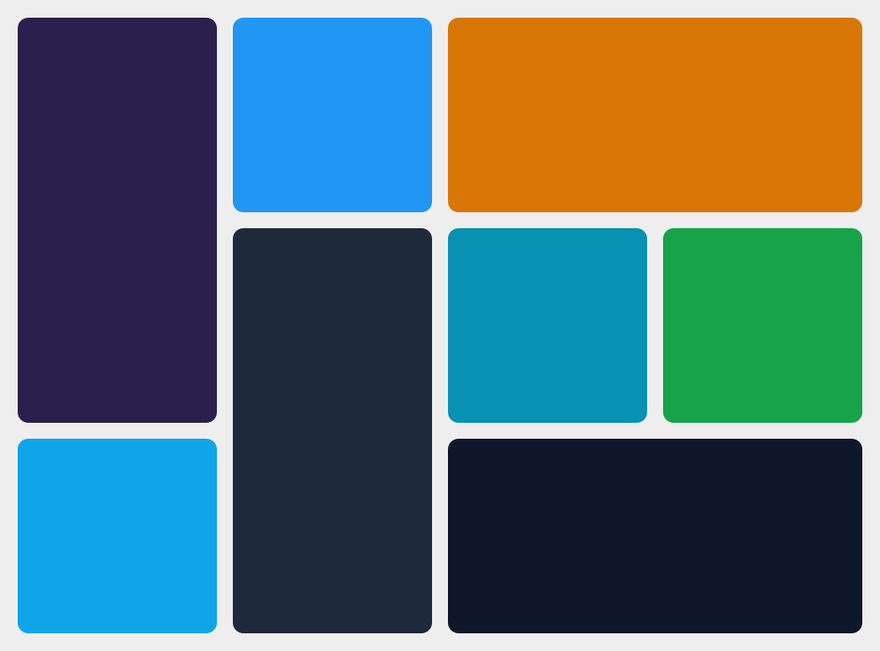 </div>

---

## Assignment 23

```html
<div class="the-grid">
  <div></div>
  <div></div>
  <div></div>
  <div></div>
  <div></div>
  <div></div>
  <div></div>
  <div></div>
  <div></div>
  <div></div>
  <div></div>
  <div></div>
  <div></div>
  <div></div>
  <div></div>
  <div></div>
  <div></div>
  <div></div>
  <div></div>
  <div></div>
</div>
```

```css
* {
  box-sizing: border-box;
}

body {
  background-color: #eeeeee;
}

.the-grid {
  display: grid;
  grid-template-columns: repeat(5, 1fr);
  grid-template-rows: repeat(14, 1fr);
  gap: 18px;
  max-width: 600px;
  margin: 30px auto;
  grid-template-areas:
    "g1 g1 g2 g3 g3"
    "g1 g1 g2 g3 g3"
    "g1 g1 g4 g4 g4"
    "g1 g1 g4 g4 g4"
    "g5 g5 g4 g4 g4"
    "g5 g5 g4 g4 g4"
    "g6 g6 g6 g6 g7"
    "g6 g6 g6 g6 g7"
    "g8 g9 g9 g9 g10"
    "g8 g9 g9 g9 g11"
    "g8 g9 g9 g9 g12"
    "g13 g13 g13 g13 g13"
    "g14 g14 g15 g15 g15"
    "g16 g17 g18 g19 g20";
}

.the-grid div {
  background-color: white;
  border-radius: 4px;
  display: flex;
  align-items: center;
  justify-content: center;
  font-weight: bold;
  font-size: 20px;
  color: #111;
}

.the-grid div:nth-child(1)  { grid-area: g1; }
.the-grid div:nth-child(2)  { grid-area: g2; }
.the-grid div:nth-child(3)  { grid-area: g3; }
.the-grid div:nth-child(4)  { grid-area: g4; }
.the-grid div:nth-child(5)  { grid-area: g5; }
.the-grid div:nth-child(6)  { grid-area: g6; }
.the-grid div:nth-child(7)  { grid-area: g7; }
.the-grid div:nth-child(8)  { grid-area: g8; }
.the-grid div:nth-child(9)  { grid-area: g9; }
.the-grid div:nth-child(10) { grid-area: g10; }
.the-grid div:nth-child(11) { grid-area: g11; }
.the-grid div:nth-child(12) { grid-area: g12; }
.the-grid div:nth-child(13) { grid-area: g13; }
.the-grid div:nth-child(14) { grid-area: g14; }
.the-grid div:nth-child(15) { grid-area: g15; }
.the-grid div:nth-child(16) { grid-area: g16; }
.the-grid div:nth-child(17) { grid-area: g17; }
.the-grid div:nth-child(18) { grid-area: g18; }
.the-grid div:nth-child(19) { grid-area: g19; }
.the-grid div:nth-child(20) { grid-area: g20; }
```

<div style="display:flex; justify-content:center; align-items:center; gap:16px; flex-wrap:wrap;"> 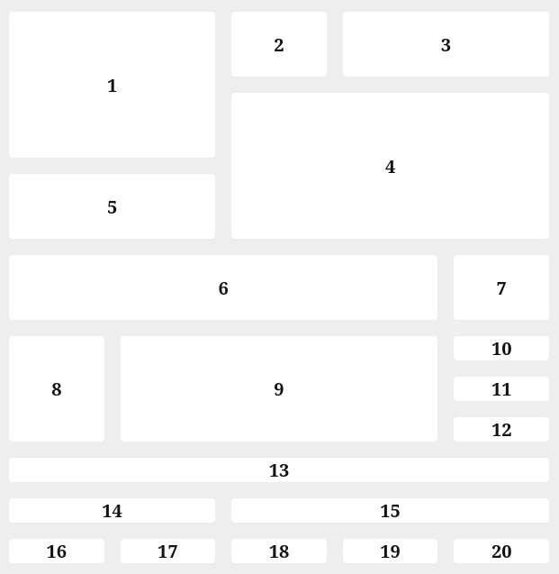 </div>

---

## Assignment 24

```html
<div class="our-skills">
        <div class="prog-holder">
            <h4>Money</h4>
            <h5>$20.000</h5>
            <div class="prog">
                <span style="width: 80%" data-progress="80%"></span>
            </div>
        </div>
        <div class="prog-holder">
            <h4>Projects</h4>
            <h5>24</h5>
            <div class="prog">
                <span style="width: 55%" data-progress="55%"></span>
            </div>
        </div>
        <div class="prog-holder">
            <h4>Team</h4>
            <h5>12</h5>
            <div class="prog">
                <span style="width: 75%" data-progress="75%"></span>
            </div>
        </div>
    </div>
```

```css
* {
    margin: 0;
    padding: 0;
    box-sizing: border-box;
}

body {
    margin: 0;
    min-height: 100vh;
    background: #eee;
    display: flex;
    align-items: center;
    justify-content: center;
    font-family: Arial, Helvetica, sans-serif;
}

.our-skills {
    background: #fff;
    border-radius: 16px;
    padding: 20px 32px;
    width: 900px;
    max-width: 90vw;
}

.our-skills .prog-holder:nth-of-type(1) {
    --main-color: #1976f2;
}

.our-skills .prog-holder:nth-of-type(2) {
    --main-color: #f2a71b;
}

.our-skills .prog-holder:nth-of-type(3) {
    --main-color: #22a35d;
}

.our-skills .prog-holder {
    margin-bottom: 40px;
}

.our-skills .prog-holder:last-child {
    margin-bottom: 20px;
}

.our-skills .prog-holder h4 {
    font-weight: 400;
    font-size: 15px;
    color: #9a9a9a;
    text-transform: capitalize;
}

.our-skills .prog-holder h5 {
    font-weight: 700;
    font-size: 20px;
    color: #1a1a1a;
}

.our-skills .prog-holder .prog {
    background-color: #e9e9ec;
    height: 6px;
    border-radius: 999px;
}

.our-skills .prog-holder .prog span {
    display: block;
    background-color: var(--main-color);
    height: 6px;
    border-radius: 999px;
    position: relative;
}

.our-skills .prog-holder .prog span::before {
    content: attr(data-progress);
    position: absolute;
    background-color: var(--main-color);
    color: white;
    font-size: 13px;
    font-weight: 700;
    top: -33px;
    right: 0;
    transform: translateX(50%);
    padding: 6px 10px;
    border-radius: 6px;
    white-space: nowrap;
}

.our-skills .prog-holder .prog span::after {
    content: "";
    position: absolute;
    border-style: solid;
    border-width: 6px 6px 0 6px;
    border-color: var(--main-color) transparent transparent transparent;
    right: 0;
    top: -6px;
    transform: translateX(50%);
}
```

<div style="display:flex; justify-content:center; align-items:center; gap:16px; flex-wrap:wrap;"> 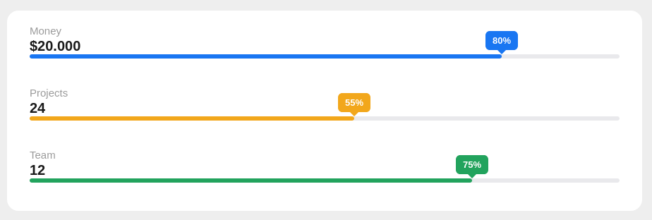 </div>

---

## Assignment 25

```html
<div class="login-card">
  <div class="header">Login</div>
  <div class="body">
    <div class="left-side">
      <label for="e">Email</label>
      <input type="email" name="" id="e">
      <label for="p">Password</label>
      <input type="password" name="" id="p">
      <button type="button" class="login-btn">Login</button>
    </div>
    <div class="divider">
      <span>Or</span>
    </div>
    <div class="right-side">
      <label class="connect-label">Connect</label>
      <button class="facebook">Facebook</button>
      <button class="twitter">Twitter</button>
      <button class="linkedin">Linkedin</button>
    </div>
  </div>
</div>
```

```css
* {
  box-sizing: border-box;
  font-family: Arial, Helvetica, sans-serif;
}

body {
  background-color: #eeeeee;
  height: 100vh;
  display: flex;
  align-items: center;
  justify-content: center;
}

.login-card {
  width: 650px;
  margin: 0 auto;
  background-color: white;
  border-radius: 6px;
  overflow: hidden;
}

.header {
  background-color: #0d7cf2;
  color: white;
  font-size: 28px;
  font-weight: bold;
  text-align: center;
  padding: 20px;
}

.body {
  display: grid;
  grid-template-columns: 1fr 60px 1fr;
  gap: 0;
  padding: 30px 40px;
}

.left-side,
.right-side {
  display: flex;
  flex-direction: column;
}

.left-side label {
  color: #777;
  margin-bottom: 8px;
}

.left-side input {
  border: 1px solid #ddd;
  background-color: #fdfaf9;
  border-radius: 5px;
  padding: 10px;
  margin-bottom: 20px;
  outline: none;
}

.login-btn {
  background-color: #0d7cf2;
  color: white;
  border: none;
  padding: 10px;
  border-radius: 5px;
  font-size: 16px;
  cursor: pointer;
}

.divider {
  position: relative;
  display: flex;
  align-items: center;
  justify-content: center;
}

.divider::before {
  content: "";
  position: absolute;
  top: 0;
  bottom: 0;
  left: 50%;
  width: 2px;
  background-color: #ddd;
}

.divider span {
  position: relative;
  background-color: white;
  color: #777;
  padding: 10px 0;
  z-index: 1;
}

.connect-label {
  color: #777;
  margin-bottom: 20px;
  text-align: center;
}

.right-side button {
  border: none;
  color: white;
  padding: 12px;
  border-radius: 5px;
  font-size: 16px;
  margin-bottom: 15px;
  cursor: pointer;
}

.facebook {
  background-color: #2e6fdb;
}

.twitter {
  background-color: #3ba9e0;
}

.linkedin {
  background-color: #0d6099;
}
```

<div style="display:flex; justify-content:center; align-items:center; gap:16px; flex-wrap:wrap;"> 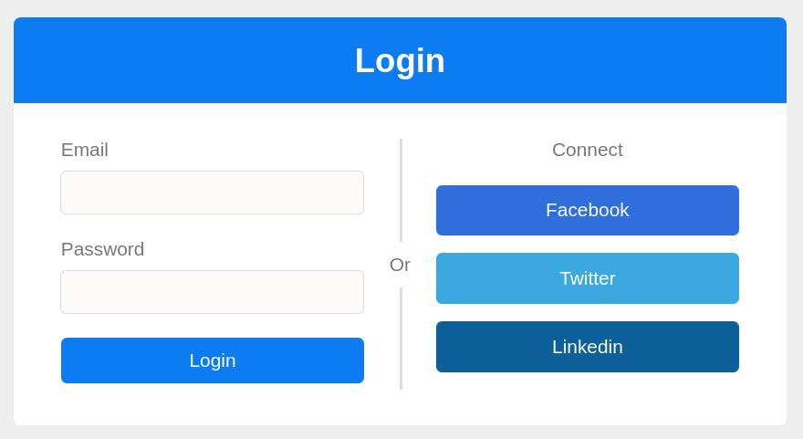 </div>